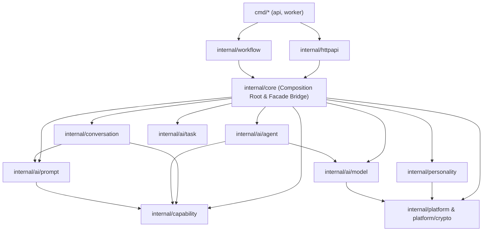

# 摇光项目第六阶段：internal/core Package 模块化迁移映射与架构拓扑

## 1. 架构分层设计与依赖拓扑

重构后的包拓扑遵循严格的单向依赖原则（分层架构），绝无反向依赖，严禁循环依赖：

### 依赖分层约束规则
1. **底座层 (Infrastructure / Platform)**:
   - [`internal/platform/crypto`](file:///Users/vinson/Documents/project/个人/local-ai-companion/apps/core-go/internal/platform/crypto): 通用加解密算法，零领域依赖。
2. **AI 基础抽象层 (AI Subsystem)**:
   - [`internal/ai/model`](file:///Users/vinson/Documents/project/个人/local-ai-companion/apps/core-go/internal/ai/model): 模型运行时、队列调度、Redis 队列。
   - [`internal/ai/prompt`](file:///Users/vinson/Documents/project/个人/local-ai-companion/apps/core-go/internal/ai/prompt): 提示词格式化、插槽定义、模板渲染。
   - [`internal/ai/task`](file:///Users/vinson/Documents/project/个人/local-ai-companion/apps/core-go/internal/ai/task): 结构化任务定义与多语言契约。
   - [`internal/ai/agent`](file:///Users/vinson/Documents/project/个人/local-ai-companion/apps/core-go/internal/ai/agent): ADK Agent Loop 执行内核、多轮决策上下文。
3. **能力协议层 (Capability)**:
   - [`internal/capability`](file:///Users/vinson/Documents/project/个人/local-ai-companion/apps/core-go/internal/capability): 能力定义、上下文插槽、执行契约、注册表。
4. **核心领域模型层 (Domain Core)**:
   - [`internal/personality`](file:///Users/vinson/Documents/project/个人/local-ai-companion/apps/core-go/internal/personality): 情感计算 (PAD/Momentum/Decay)、人格切换规则、接管仲裁规则、转机权限。
   - [`internal/conversation`](file:///Users/vinson/Documents/project/个人/local-ai-companion/apps/core-go/internal/conversation): 会话消息模型、原始历史筛选、可见输出绑定契约。
5. **应用编排与装配层 (Composition Root & Application Service)**:
   - [`internal/core`](file:///Users/vinson/Documents/project/个人/local-ai-companion/apps/core-go/internal/core): 作为核心业务组装层、数据库事务持有者、静态守卫契约测试驻留地，桥接所有新 package 与现有上层服务（`workflow`, `httpapi`）。

---

## 2. 详细迁移映射清单 (Package Migration Map)

| 原始文件 (`internal/core/`) | 目标 Package | 迁移与拆分内容 | 迁移策略与桥接方式 |
| :--- | :--- | :--- | :--- |
| `crypto.go` | `internal/platform/crypto` | AES-GCM / 随机密钥生成与加解密 | 物理抽离，原文件委托转发 |
| `capability_core.go`, `capability_registry.go`, `capability_internal_support.go` | `internal/capability` | `CapabilityDefinition`, `CapabilityInvocation`, `CapabilityResult`, `ContextSlot`, `Registry` | 原生定义于新包，`core` 使用类型别名 `type T = capability.T` 桥接 |
| `provider_queue.go`, `provider_redis_queue.go`, `eino_model_runtime.go` | `internal/ai/model` | 内存模型队列、Redis 优先队列调度模型、Eino 运行时接口 | 核心抽象与单测迁移至新包，保留原文件保留源码扫描 pattern 守卫 |
| `provider_prompts.go`, `provider_prompt_format.go`, `prompt_slots.go`, `working_memory.go` | `internal/ai/prompt` | 提示词格式化、Token 估算、Slot 规范、Working Memory 组装 | 格式化与基础 Slot 规范迁移至新包，原文件类型别名并平滑转接 |
| `provider_language.go`, `provider_shape.go` | `internal/ai/task` | 任务多语言指令模板、结构化输出 Shape 构造器 | 契约与单测迁移至新包，原文件类型别名转接 |
| `adk_conversation_runtime.go` | `internal/ai/agent` | Eino ADK Agent Loop 循环、Turn Budget、工具调用组装 | Loop 核心逻辑与单测迁移至新包，原文件平滑委托 |
| `affect_reducer.go` | `internal/personality` | PAD 向量、动量、半衰期情感计算公式 | 算法提取至新包，保留原文件保留静态守卫所需代码特征 |
| `persona_switch_rules.go`, `persistent_switch_gate.go` | `internal/personality` | 接管规则、持久切换 Gate、TurnPersonaScope、诊断结构 | 核心数据结构、规则过滤与决策提炼至 `personality/rules.go`，`core` 建立别名 |
| `visible_output.go`, `raw_history.go`, `query_continuation.go` | `internal/conversation` | 历史消息提取、可见文本绑定、Query 续写契约 | 数据结构与算法下沉至新包，业务事务与数据库查询保留在 `core` |

---

## 3. 架构守护与编译约束保证

1. **静态扫描与 Architecture Guard 100% 兼容**：
   - 保留了 `affect_reducer.go` 中的模式串（`case "pad":`, `clampBipolar` 等）。
   - 保留了 `provider_redis_queue.go` 中的 `aged_score` 等调度算法标识符。
   - 保留了 `persona_switch_rules.go` 中针对 F-03 架构守卫的规则约束和 `declaredSwitchRuleKind` 派发。
2. **零循环依赖 (Zero Circular Dependencies)**：
   - 依赖严格自顶向下。底座包（`ai/*`, `capability`, `personality`, `platform`）没有引用 `core.App`。
   - Go 编译器强制约束，任何反向引入都会被编译器立即阻断。
3. **测试断言零降级**：
   - 全库 `go test ./...` 100% 通过（包括 `cmd/*`, `workflow`, `httpapi`, `core`, `ai/*`, `capability`, `personality`, `conversation`）。
