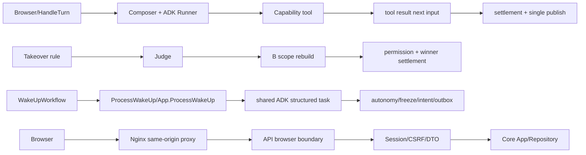

# 第五阶段验收与证据设计

## 1. Evidence levels

- L0：源码、静态架构、依赖和调用图核查。
- L1：真实 Go/Web 框架 + Fake Model/Tool/Backend 的确定性测试。
- L2：隔离 PostgreSQL/Redis/Temporal/MinIO 集成和事务副作用。
- L3：不启动独立 BFF 的真实 Web/Nginx/API 浏览器链路和部署 smoke。
- L4：受控真实 Provider、Embedding、视觉/媒体和真实兼容性验证。

每个矩阵项标记所需层级；较低层级不能替代更高层级。

## 2. Evidence run layout

```text
docs/verification/phase-5/<run-id>/
  phase-5-acceptance-report.md
  acceptance-matrix.csv
  manifest.json
  evidence/
    commands/
    code/
    tests/
    runtime/
  review-bundle.zip
```

证据使用合成 ID、截断错误和最小代码片段；manifest 记录源码 SHA、工具版本、命令索引、状态和证据文件 SHA-256，不记录机密值。

## 3. Four required evidence chains



链 A/B/C/D 必须分别引用最终代码行号、测试函数和脱敏结果；仅有文档描述不得 PASS。

## 4. Minimal repair policy

发现 FAIL 时先保存失败命令和输出，创建缺陷记录（ID、阶段、严重度、复现、根因、修复、回归测试），再做最小修复。修复后更新源码 SHA/行号、重跑针对性和相关全量门禁；无法安全运行的外部场景保持 BLOCKED。
