# 摇光系统第七阶段：模块职责、依赖方向与应用架构治理审计报告

> 报告生成时间：2026-09-20  
> 审计基准分支：`codex/yaoguang-core-modularization-phase6`  
> 准则：基于当前真实源码，不含推测，所有结论与问题均附带精确代码位置（`file:line`），先做职责审计，不直接修改代码。

---

# 一、前置条件核查与第六阶段遗留债务清单

根据第七阶段准则，开始前必须对第六阶段（Package Modularization）的完成度与验收状态进行真实性审计。

## 1.1 前置条件核查结论

| 前置检查项 | 要求状态 | 实际代码核查结果 | 判定 |
| :--- | :--- | :--- | :--- |
| **1. `internal/core` 物理拆包** | 完成计划拆包 | 仅完成 AI 底座与 Capability 抽离；Conversation 仅抽出 2 个小文件；Cognition、Memory、Schedule、Media、VisualIdentity **完全未创建 package**，仍在 `core` 内 | **未达成 (BLOCKED)** |
| **2. AI 基础 package 边界** | 具有明确边界 | `ai/model`, `ai/prompt`, `ai/agent`, `ai/task` 目录已建立，但 `ProviderClient` (1336行) 和所有 `Run*Task` 仍在 `core` | **部分达成** |
| **3. Capability package 边界** | 具有明确边界 | `internal/capability` 已建，但接口直接依赖 `pgx.Tx`，且全部具体业务 Tool 实现（757行）依然持有 `*core.App` | **部分达成** |
| **4. Conversation/Cognition 模块**| 主要模块已形成 | `internal/conversation` 仅有 105 行 DTO/类型定义，核心流程仍在 `core`；`internal/cognition/*` 目录**根本不存在** | **未达成 (BLOCKED)** |
| **5. 无大量临时 Facade/Bridge** | 不存在临时桥接 | `internal/core` 存在大量 `type T = other.T` 别名与转发 Wrapper（详见下节清单） | **未达成 (存在大量别名)** |
| **6. Behavior Freeze 回归** | 回归测试通过 | `go test ./...` 编译与单元测试全部 PASS（存在环境依赖的 DB 测试正常 Skip） | **通过 (PASS)** |
| **7. 依赖拓扑无环** | Go 无循环依赖 | `go list` 与编译验证无循环依赖，底层包没有反向 import `core` | **通过 (PASS)** |
| **8. 当前代码构建正常** | 能够正常构建 | `cmd/api`, `cmd/worker` 编译构建正常 | **通过 (PASS)** |

**结论**：第六阶段在任务卡 `.trellis/tasks/09-20-yaoguang-core-modularization-phase6/task.json` 中仍处于 `in_progress` 状态，工作区有 34 个未提交变更与 14 个未跟踪文件。计划中的 Group 3 (Conversation 下沉)、Group 4 (Cognition 下沉)、Group 5 (领域包拆分) 尚未完成。**这些未完成项属于第六阶段的物理拆包债务，严禁在第七阶段直接掩盖。**

---

## 1.2 第六阶段“临时为了编译”创建的 Facade / Bridge / Alias 清单

为了保证已有单测和 `core.App` 的编译不中断，第六阶段在 `internal/core` 中引入了大量兼容性类型别名与委托包装：

1. **`internal/core/capability_core.go` (共 9 处类型别名)**:
   - `type CapabilityType = capability.CapabilityType` ([`capability_core.go:19`](file:///Users/vinson/Documents/project/个人/local-ai-companion/apps/core-go/internal/core/capability_core.go#L19))
   - `type CapabilitySurface = capability.CapabilitySurface` ([`capability_core.go:27`](file:///Users/vinson/Documents/project/个人/local-ai-companion/apps/core-go/internal/core/capability_core.go#L27))
   - `type CapabilityFailurePolicy = capability.CapabilityFailurePolicy` ([`capability_core.go:37`](file:///Users/vinson/Documents/project/个人/local-ai-companion/apps/core-go/internal/core/capability_core.go#L37))
   - `type CapabilityExecutionClass = capability.CapabilityExecutionClass` ([`capability_core.go:44`](file:///Users/vinson/Documents/project/个人/local-ai-companion/apps/core-go/internal/core/capability_core.go#L44))
   - `type ContextSlot = capability.ContextSlot` ([`capability_core.go:81`](file:///Users/vinson/Documents/project/个人/local-ai-companion/apps/core-go/internal/core/capability_core.go#L81))
   - `type CapabilityDefinition = capability.CapabilityDefinition` ([`capability_core.go:680`](file:///Users/vinson/Documents/project/个人/local-ai-companion/apps/core-go/internal/core/capability_core.go#L680))
   - `type CapabilityInvocation = capability.CapabilityInvocation` ([`capability_core.go:833`](file:///Users/vinson/Documents/project/个人/local-ai-companion/apps/core-go/internal/core/capability_core.go#L833))
   - `type InvocationMetadata = capability.InvocationMetadata` ([`capability_core.go:834`](file:///Users/vinson/Documents/project/个人/local-ai-companion/apps/core-go/internal/core/capability_core.go#L834))
   - `type CapabilityResult = capability.CapabilityResult` ([`capability_core.go:1135`](file:///Users/vinson/Documents/project/个人/local-ai-companion/apps/core-go/internal/core/capability_core.go#L1135))
2. **`internal/core/composite_actions.go` (1 处类型别名)**:
   - `type OutputBindingV1 = capability.OutputBindingV1` ([`composite_actions.go:34`](file:///Users/vinson/Documents/project/个人/local-ai-companion/apps/core-go/internal/core/composite_actions.go#L34))
3. **`internal/core/adk_conversation_runtime.go` (6 处类型别名 + Bridge Adapter)**:
   - `type ADKCapabilityTrace = aiagent.ADKCapabilityTrace` ([`adk_conversation_runtime.go:21`](file:///Users/vinson/Documents/project/个人/local-ai-companion/apps/core-go/internal/core/adk_conversation_runtime.go#L21))
   - `type ADKCapabilityInvoker = aiagent.ADKCapabilityInvoker` ([`adk_conversation_runtime.go:193`](file:///Users/vinson/Documents/project/个人/local-ai-companion/apps/core-go/internal/core/adk_conversation_runtime.go#L193))
   - `type ADKCapabilityInvokerWithID = aiagent.ADKCapabilityInvokerWithID` ([`adk_conversation_runtime.go:194`](file:///Users/vinson/Documents/project/个人/local-ai-companion/apps/core-go/internal/core/adk_conversation_runtime.go#L194))
   - `type ADKLoopConfig = aiagent.ADKLoopConfig` ([`adk_conversation_runtime.go:195`](file:///Users/vinson/Documents/project/个人/local-ai-companion/apps/core-go/internal/core/adk_conversation_runtime.go#L195))
   - `type ADKLoopResult = aiagent.ADKLoopResult` ([`adk_conversation_runtime.go:196`](file:///Users/vinson/Documents/project/个人/local-ai-companion/apps/core-go/internal/core/adk_conversation_runtime.go#L196))
   - `type adkCapabilityTool = aiagent.ADKCapabilityTool` ([`adk_conversation_runtime.go:197`](file:///Users/vinson/Documents/project/个人/local-ai-companion/apps/core-go/internal/core/adk_conversation_runtime.go#L197))
   - Bridge: `runADKConversationLoop` 将 `*App` 包装为 `adkBridgeInvoker` 传递给底层 runner ([`adk_conversation_runtime.go:199-230`](file:///Users/vinson/Documents/project/个人/local-ai-companion/apps/core-go/internal/core/adk_conversation_runtime.go#L199-L230))
4. **`internal/core/eino_model_runtime.go` (2 处类型别名 + Factory 转发)**:
   - `type EinoModelConfig = aimodel.EinoModelConfig` ([`eino_model_runtime.go:27`](file:///Users/vinson/Documents/project/个人/local-ai-companion/apps/core-go/internal/core/eino_model_runtime.go#L27))
   - `type EinoModelFactory = aimodel.EinoModelFactory` ([`eino_model_runtime.go:30`](file:///Users/vinson/Documents/project/个人/local-ai-companion/apps/core-go/internal/core/eino_model_runtime.go#L30))
   - 转发函数：`NewEinoModelFactory` ([`eino_model_runtime.go:32`](file:///Users/vinson/Documents/project/个人/local-ai-companion/apps/core-go/internal/core/eino_model_runtime.go#L32))
5. **`internal/core/provider_queue.go` & `provider_redis_queue.go` (4 处类型别名)**:
   - `type providerQueueClass = model.QueueClass` ([`provider_queue.go:20`](file:///Users/vinson/Documents/project/个人/local-ai-companion/apps/core-go/internal/core/provider_queue.go#L20))
   - `type providerQueueTask = model.QueueTask` ([`provider_queue.go:27`](file:///Users/vinson/Documents/project/个人/local-ai-companion/apps/core-go/internal/core/provider_queue.go#L27))
   - `type providerTaskHeap = model.TaskHeap` ([`provider_queue.go:28`](file:///Users/vinson/Documents/project/个人/local-ai-companion/apps/core-go/internal/core/provider_queue.go#L28))
   - `type providerCancellationKey = model.CancellationKey` ([`provider_redis_queue.go:27`](file:///Users/vinson/Documents/project/个人/local-ai-companion/apps/core-go/internal/core/provider_redis_queue.go#L27))
6. **`internal/core/prompt_slots.go` & `working_memory.go` (5 处类型别名)**:
   - `type PromptSlotID = aiprompt.PromptSlotID` ([`prompt_slots.go:13`](file:///Users/vinson/Documents/project/个人/local-ai-companion/apps/core-go/internal/core/prompt_slots.go#L13))
   - `type PromptSlotPosition = aiprompt.PromptSlotPosition` ([`prompt_slots.go:14`](file:///Users/vinson/Documents/project/个人/local-ai-companion/apps/core-go/internal/core/prompt_slots.go#L14))
   - `type PromptSlot = aiprompt.PromptSlot` ([`prompt_slots.go:36`](file:///Users/vinson/Documents/project/个人/local-ai-companion/apps/core-go/internal/core/prompt_slots.go#L36))
   - `type PromptFragmentKind = aiprompt.PromptFragmentKind` ([`working_memory.go:11`](file:///Users/vinson/Documents/project/个人/local-ai-companion/apps/core-go/internal/core/working_memory.go#L11))
   - `type PromptFragment = aiprompt.PromptFragment` ([`working_memory.go:21`](file:///Users/vinson/Documents/project/个人/local-ai-companion/apps/core-go/internal/core/working_memory.go#L21))
7. **`internal/core/affect_reducer.go` (3 处类型别名 + 状态计算算法未下沉)**:
   - `type AffectProfile = personality.AffectProfile` ([`affect_reducer.go:14`](file:///Users/vinson/Documents/project/个人/local-ai-companion/apps/core-go/internal/core/affect_reducer.go#L14))
   - `type affectReductionInput = personality.AffectReductionInput` ([`affect_reducer.go:15`](file:///Users/vinson/Documents/project/个人/local-ai-companion/apps/core-go/internal/core/affect_reducer.go#L15))
   - `type driveSemanticSignal = personality.DriveSemanticSignal` ([`affect_reducer.go:16`](file:///Users/vinson/Documents/project/个人/local-ai-companion/apps/core-go/internal/core/affect_reducer.go#L16))
   - 重复实现：`reduceAffectState` 与 `projectAffectStateAt` 全部完整保留在 `core/affect_reducer.go`，未真正迁移至 `personality`。
8. **`internal/core/persona_switch_rules.go` (6 处类型别名)**:
   - `type personaSwitchRuleKind = personality.PersonaSwitchRuleKind` ([`persona_switch_rules.go:16`](file:///Users/vinson/Documents/project/个人/local-ai-companion/apps/core-go/internal/core/persona_switch_rules.go#L16))
   - `type personaSwitchRule = personality.PersonaSwitchRule` ([`persona_switch_rules.go:52`](file:///Users/vinson/Documents/project/个人/local-ai-companion/apps/core-go/internal/core/persona_switch_rules.go#L52))
   - `type personaSwitchDiagnostic = personality.PersonaSwitchDiagnostic` ([`persona_switch_rules.go:53`](file:///Users/vinson/Documents/project/个人/local-ai-companion/apps/core-go/internal/core/persona_switch_rules.go#L53))
   - `type personaSwitchNormalization = personality.PersonaSwitchNormalization` ([`persona_switch_rules.go:54`](file:///Users/vinson/Documents/project/个人/local-ai-companion/apps/core-go/internal/core/persona_switch_rules.go#L54))
   - `type persistentSwitchGrant = personality.PersistentSwitchGrant` ([`persona_switch_rules.go:55`](file:///Users/vinson/Documents/project/个人/local-ai-companion/apps/core-go/internal/core/persona_switch_rules.go#L55))
   - `type turnPersonaScope = personality.TurnPersonaScope` ([`persona_switch_rules.go:56`](file:///Users/vinson/Documents/project/个人/local-ai-companion/apps/core-go/internal/core/persona_switch_rules.go#L56))
9. **`internal/core/raw_history.go` (5 处类型别名)**:
   - `type RawHistoryKind = conversation.RawHistoryKind` ([`raw_history.go:24`](file:///Users/vinson/Documents/project/个人/local-ai-companion/apps/core-go/internal/core/raw_history.go#L24))
   - `type RawHistoryEvent = conversation.RawHistoryEvent` ([`raw_history.go:25`](file:///Users/vinson/Documents/project/个人/local-ai-companion/apps/core-go/internal/core/raw_history.go#L25))
   - `type RawHistoryQuery = conversation.RawHistoryQuery` ([`raw_history.go:26`](file:///Users/vinson/Documents/project/个人/local-ai-companion/apps/core-go/internal/core/raw_history.go#L26))
   - `type RawHistorySearchQuery = conversation.RawHistorySearchQuery` ([`raw_history.go:27`](file:///Users/vinson/Documents/project/个人/local-ai-companion/apps/core-go/internal/core/raw_history.go#L27))
   - `type RawHistorySourceQuery = conversation.RawHistorySourceQuery` ([`raw_history.go:28`](file:///Users/vinson/Documents/project/个人/local-ai-companion/apps/core-go/internal/core/raw_history.go#L28))
10. **`internal/core/visible_output.go` (2 处类型别名)**:
    - `type canonicalVisibleReply = conversation.CanonicalVisibleReply` ([`visible_output.go:9`](file:///Users/vinson/Documents/project/个人/local-ai-companion/apps/core-go/internal/core/visible_output.go#L9))
    - `type visibleTextDiagnostic = conversation.VisibleTextDiagnostic` ([`visible_output.go:19`](file:///Users/vinson/Documents/project/个人/local-ai-companion/apps/core-go/internal/core/visible_output.go#L19))
11. **`internal/core/crypto.go` (包装函数)**:
    - `decodeSettingsKey`: 直接包装 `platformcrypto.DecodeSettingsKey` ([`crypto.go:69-71`](file:///Users/vinson/Documents/project/个人/local-ai-companion/apps/core-go/internal/core/crypto.go#L69-L71))
    - `decryptSecret`: 直接包装 `platformcrypto.DecryptSecret` ([`crypto.go:73-75`](file:///Users/vinson/Documents/project/个人/local-ai-companion/apps/core-go/internal/core/crypto.go#L73-L75))

---

# 二、十八模块职责、依赖与架构全量审计

以下针对规范要求的 18 个核心包及业务领域（含物理包与仍驻留在 `internal/core` 内的逻辑模块），逐一按照标准模板进行代码级证据审计。

---

### 1. `ai/model`
```text
ai/model
├── 当前职责: Eino Chat/Embedding Model 工厂构造、内存优先级任务队列调度、Redis 分布式锁与队列状态调度
├── 当前公开 API: EinoModelConfig, EinoModelFactory, NewEinoModelFactory, Queue, TaskHeap, RedisQueue, QueueClass, CancellationKey
├── 当前依赖: cloudwego/eino-ext (openai, embedding), cloudwego/eino/components, redis/go-redis/v9, 标准库
├── 当前被谁依赖: internal/core/eino_model_runtime.go, internal/core/provider_queue.go, internal/core/provider_redis_queue.go
├── 持有的基础设施: redis.UniversalClient (redis_queue.go:23), net/http.Client (eino_runtime.go:35)
├── 是否开启事务: 否
├── 是否直接 SQL: 否
├── 是否调用模型: 否 (仅返回 eino model.ToolCallingChatModel 与 embedding.Embedder 实例，调用由使用者发起)
├── 是否执行 Capability: 否
├── 是否发布 Event / Outbox: 否
└── 当前明显职责问题:
    1. 缺少核心 ProviderClient: 实际驱动模型、解析配置、审计重试的 ProviderClient (1336行) 仍留在 core/provider.go 中并强依赖 *PostgresRepository；
    2. Redis 调度与模型工厂并置: 纯粹的调度算法 (queue.go) 与第三方 Eino 工厂 (eino_runtime.go) 置于同包，职责内聚度偏低。
```

---

### 2. `ai/prompt`
```text
ai/prompt
├── 当前职责: 提示词模板参数格式化、Token 估算预算、PromptSlot 元数据与位置定义、WorkingMemory 片段规范
├── 当前公开 API: FormatPrompt, EstimateTokens, PromptSlot, PromptSlotID, PromptSlotPosition, PromptFragment, PromptFragmentKind
├── 当前依赖: 标准库 (encoding/json, fmt, io, sort, strings, unicode/utf8)
├── 当前被谁依赖: internal/ai/task, internal/core/prompt_slots.go, internal/core/provider_prompt_format.go, internal/core/working_memory.go
├── 持有的基础设施: 无
├── 是否开启事务: 否
├── 是否直接 SQL: 否
├── 是否调用模型: 否
├── 是否执行 Capability: 否
├── 是否发布 Event / Outbox: 否
└── 当前明显职责问题:
    1. 仅为无状态字符串算法层: 真正装配系统提示词的业务逻辑 (assembleWorkingPrompt, buildSystemPrompt) 仍留在 core/provider_prompts.go:34-120；
    2. core 层存在大批同名镜像函数与类型别名，调用方并未完全切入本包。
```

---

### 3. `ai/agent`
```text
ai/agent
├── 当前职责: 基于 Eino ADK 的 Agent Loop 多轮执行循环、Turn 迭代预算控制、Tool 调用回填与 Trace 记录
├── 当前公开 API: ADKLoopConfig, ADKLoopResult, RunADKLoop, ADKCapabilityInvoker, ADKCapabilityInvokerWithID, ADKCapabilityTrace, NewADKCapabilityTools
├── 当前依赖: cloudwego/eino/adk, cloudwego/eino/compose, cloudwego/eino/schema, internal/capability
├── 当前被谁依赖: internal/core/adk_conversation_runtime.go
├── 持有的基础设施: Eino ADK Runtime (loop.go:10-16)
├── 是否开启事务: 否
├── 是否直接 SQL: 否
├── 是否调用模型: 是 (在 loop.go:120 循环中调用 model.ToolCallingChatModel.Generate)
├── 是否执行 Capability: 是 (通过 ADKCapabilityInvokerWithID 接口回调宿主执行 Capability, loop.go:180-210)
├── 是否发布 Event / Outbox: 否
└── 当前明显职责问题:
    1. 执行上下文直接穿透: 依赖 capability.CapabilityDefinition，但执行结果的回填 (ADKCapabilityTrace) 需要与 core 的冻结动作 (Frozen Actions) 进行繁重转换；
    2. core/adk_conversation_runtime.go 依然保留大量 bridge 逻辑 (435行) 来弥合 App 与 ADK Loop 间的参数差距。
```

---

### 4. `ai/task`
```text
ai/task
├── 当前职责: 提供多语言结构化指令模板、输出 JSON Schema 约束定义与 Shape 生成器
├── 当前公开 API: LanguageDirective, BuildStructuredShape, Schemas (Initialization, MediaPrompt, Takeover, Summary 等)
├── 当前依赖: internal/ai/prompt, 标准库
├── 当前被谁依赖: internal/core/provider_language.go, internal/core/provider_shape.go
├── 持有的基础设施: 无
├── 是否开启事务: 否
├── 是否直接 SQL: 否
├── 是否调用模型: 否
├── 是否执行 Capability: 否
├── 是否发布 Event / Outbox: 否
└── 当前明显职责问题:
    1. “名不副实”: 仅包含 schema 和 language 静态片段，并没有任何真正的 Model Task 执行器；
    2. 真正的业务任务（如 RunInitializationTask, RunJudgeTask, RunMediaPromptTask, RunConversationSummaryTask）全作为 App 的方法挂在 core/model_tasks.go:29-180。
```

---

### 5. `capability`
```text
capability
├── 当前职责: 定义系统 Capability 规范、上下文插槽契约 (ContextSlot)、能力注册表 (Registry) 与执行生命周期调度
├── 当前公开 API: Capability, TransactionalCapability, CapabilityDefinition, CapabilityInvocation, CapabilityResult, ContextSlot, Registry, CapabilityRuntime
├── 当前依赖: github.com/jackc/pgx/v5 (capability.go:15), 标准库
├── 当前被谁依赖: internal/ai/agent, internal/core/capability_core.go, internal/core/builtin_capabilities.go
├── 持有的基础设施: pgx.Tx (在 capability.go:1209 接口方法中直接传参)
├── 是否开启事务: 否 (自身不开启，但接口强绑定外部事务)
├── 是否直接 SQL: 否
├── 是否调用模型: 否
├── 是否执行 Capability: 是 (作为能力调度的分发内核)
├── 是否发布 Event / Outbox: 否
└── 当前明显职责问题:
    1. 基础抽象层直接耦合 pgx.Tx: 接口定义 `ExecuteTx(ctx, pgx.Tx, ...)` (capability.go:1214) 导致契约无法独立于具体数据库驱动；
    2. 业务能力实现严重倒挂: 虽有独立包，但所有 15 个具体业务 Capability 全部实现在 core/builtin_capabilities.go:73-90，并强依赖 `*core.App`。
```

---

### 6. `conversation`
```text
conversation
├── 当前职责: 会话历史只读查询 DTO 结构、消息可见文本绑定模型规范
├── 当前公开 API: RawHistoryKind, RawHistoryEvent, RawHistoryQuery, RawHistorySearchQuery, CanonicalVisibleReply, VisibleTextDiagnostic
├── 当前依赖: 标准库 (time, strings)
├── 当前被谁依赖: internal/core/raw_history.go, internal/core/visible_output.go
├── 持有的基础设施: 无
├── 是否开启事务: 否
├── 是否直接 SQL: 否
├── 是否调用模型: 否
├── 是否执行 Capability: 否
├── 是否发布 Event / Outbox: 否
└── 当前明显职责问题:
    1. 严重空心化: 仅有 2 个小文件 (105 行)，真正承载核心会话业务的 HandleTurn (819行, mutations.go:501)、turn_decision.go (327行)、turn_takeover.go (756行) 全部留在 core；
    2. 业务用例与协调流缺失，目前 conversation 包退化成了纯数据结构包。
```

---

### 7. `cognition/wakeup` (当前驻留于 `internal/core/wakeup.go`)
```text
cognition/wakeup (逻辑包，驻留于 internal/core)
├── 当前职责: 编排 WakeUp 周期唤醒流程、定时计算、自主人格意图检查、意图前置断言、模型自主决策、WakeUp 事务结算
├── 当前公开 API: (作为 App 方法公开) App.ProcessWakeUp (wakeup.go:120), App.WakeUpAutonomySettings (wakeup.go:85)
├── 当前依赖: core.App 全量上下文、pgx.Tx、Eino/ProviderClient、PostgresRepository、Outbox
├── 当前被谁依赖: internal/workflow/workflow.go:758 (通过 ProcessWakeUpActivity 调用)
├── 持有的基础设施: 直接使用 a.DB.Pool() (wakeup.go:210), 持有 Temporal Context
├── 是否开启事务: 是 (在 wakeup.go:380 中开启 withTransaction 提交状态变更)
├── 是否直接 SQL: 是 (多处执行原生 SQL 校验与写入，如 wakeup.go:395)
├── 是否调用模型: 是 (在 wakeup.go:280 构造 prompt 并调用 a.Provider.Structured)
├── 是否执行 Capability: 是 (通过 runtime.ExecuteTransactional 调度自主行为，wakeup.go:340)
├── 是否发布 Event / Outbox: 是 (在结算事务内调用 appendOutboxTx 写入 wake_up.executed 事件)
└── 当前明显职责问题:
    1. 未物理独立: 仍挤在 core 内部，直接侵入 App 结构体；
    2. 混合了用例编排、SQL 操作、模型调用和 Outbox 写入，未区分 Application UseCase 与 Infrastructure Repository。
```

---

### 8. `cognition/reflection` (当前驻留于 `internal/core/reflection_*.go`)
```text
cognition/reflection (逻辑包，驻留于 internal/core)
├── 当前职责: 闭环反思流水线 (Reflection V2)、事实收集、证据修剪 (compactReflectionEvidenceV2)、多领域演化 Proposal 校验与闭环提交
├── 当前公开 API: (作为 App 方法) App.ProcessReflection (reflection_runtime_v2.go:208)
├── 当前依赖: core.App 全量上下文、pgx.Tx、ProviderClient、Outbox
├── 当前被谁依赖: internal/workflow/workflow.go:769 (通过 ProcessReflectionActivity 调用)
├── 持有的基础设施: a.DB.Pool() (reflection_runtime_v2.go:230)
├── 是否开启事务: 是 (在 reflection_runtime_v2.go:360 开启原子提交事务)
├── 是否直接 SQL: 是 (reflection_domains_v2.go 与 reflection_window_v2.go 包含大量原生 SQL)
├── 是否调用模型: 是 (调用 ProviderClient 生成反思提案)
├── 是否执行 Capability: 否 (反思通过 Proposal 直接提案，不以 Tool 形式运行)
├── 是否发布 Event / Outbox: 是 (在 reflection 事务内写入 proposal.committed 出件)
└── 当前明显职责问题:
    1. 跨域写权限过大: 反思结算直接在单个大事务中修改 active_memory、memory、goals、preferences、drives，缺乏领域边界防护；
    2. 物理文件分散却同属 core: 包含 6 个源码文件 (共 2600+ 行)，未建立独立的 cognition/reflection 包。
```

---

### 9. `cognition/review / native` (当前驻留于 `internal/core/autonomy.go`, `cognition.go`, `cognition_growth.go`)
```text
cognition/review / native (逻辑包，驻留于 internal/core)
├── 当前职责: 日常审查 (Daily Review) 流程、原生认知循环 (Native Cognition)、事实 Claim/抢占生命周期、认知增长事实处理
├── 当前公开 API: App.ProcessDailyReview (autonomy.go:17), App.ProcessCognitionInbox (cognition.go:34), App.ProcessCognitionGrowth (cognition_growth.go:28)
├── 当前依赖: core.App, pgx.Tx, Redis triggers, Outbox
├── 当前被谁依赖: internal/workflow/workflow.go (ProcessDailyReviewActivity, ProcessCognitionProcessingActivity)
├── 持有的基础设施: a.DB.Pool(), a.Redis (分布式锁与事实 Claim)
├── 是否开启事务: 是 (各流程独立开启短事务)
├── 是否直接 SQL: 是 (如 cognition.go:380 中直接更新 cognition_inbox_facts)
├── 是否调用模型: 是 (Daily Review 中调用模型提炼日程与状态)
├── 是否执行 Capability: 是 (通过 CapabilityRuntime 调度自治 Action)
├── 是否发布 Event / Outbox: 是
└── 当前明显职责问题:
    1. 核心状态机与基础设施深度绑定: Claim 机制同时使用 PostgreSQL 行锁与 Redis 超时机制，强耦合于 core.App；
    2. 缺乏独立的 UseCase 封装，由活动 worker 直接调用 `app.Process*` 巨型函数。
```

---

### 10. `personality`
```text
personality
├── 当前职责: 存放 PAD 情感向量模型定义 (AffectProfile)、人格切换规则枚举与诊断结构体
├── 当前公开 API: AffectProfile, AffectReductionInput, DriveSemanticSignal, PersonaSwitchRuleKind, PersonaSwitchRule, PersistentSwitchGrant, TurnPersonaScope
├── 当前依赖: 标准库 (math, time, strings)
├── 当前被谁依赖: internal/core/affect_reducer.go, internal/core/persona_switch_rules.go, internal/core/persistent_switch_gate.go
├── 持有的基础设施: 无
├── 是否开启事务: 否
├── 是否直接 SQL: 否
├── 是否调用模型: 否
├── 是否执行 Capability: 否
├── 是否发布 Event / Outbox: 否
└── 当前明显职责问题:
    1. 算法与数据割裂: 核心算法 `reduceAffectState` (346行) 仍留在 core/affect_reducer.go，未迁移到 personality 包；
    2. 人格持久切换门禁 (persistent_switch_gate.go) 与模型仲裁 (persistent_switch_assessment.go) 依然滞留在 core，未能形成内聚的人格领域服务。
```

---

### 11. `memory` (当前驻留于 `internal/core/memory_*.go`, `active_memory*.go`, `working_memory.go`)
```text
memory (逻辑包，驻留于 internal/core)
├── 当前职责: 长期语义记忆检索 (pgvector)、记忆生命周期管理、Working Memory 组装、Active Memory 动态维护、记忆 Recall Capability
├── 当前公开 API: (挂载于 App) App.RetrieveMemories (memory_retrieval.go), App.CreateMemory, App.applyMemoryRecallCapability
├── 当前依赖: PostgresRepository (pgvector SQL), ProviderClient (Embedding 生成), Outbox
├── 当前被谁依赖: Conversation HandleTurn, WakeUp, Reflection, Builtin Capabilities
├── 持有的基础设施: PostgreSQL pgvector 连接池, Redis Embedding 队列
├── 是否开启事务: 是 (写入记忆与 Active Memory 时开启事务)
├── 是否直接 SQL: 是 (memory_retrieval.go:120 含有复杂的 pgvector 余弦相似度计算原生 SQL)
├── 是否调用模型: 是 (调用模型生成 Embedding 向量)
├── 是否执行 Capability: 否 (自身被包装为 Capability)
├── 是否发布 Event / Outbox: 是 (记忆变更发布 outbox 事件)
└── 当前明显职责问题:
    1. 物理包不存在: 8 个记忆相关源文件 (2200+ 行) 散落在 core 内；
    2. 读写混合: 上层构建上下文时直接调用底层带有 SQL 的 Retrieve 方法，无隔离的 MemoryReader 抽象。
```

---

### 12. `schedule` (当前驻留于 `internal/core/schedule_*.go`, `mutations.go`)
```text
schedule (逻辑包，驻留于 internal/core)
├── 当前职责: 日程生成模型调用、日程冲突校验与时区规整、用户接受日程事务结算 (AcceptSchedule)、重排能力 (scheduleReplanCapability)
├── 当前公开 API: App.AcceptSchedule (mutations.go:36), App.GenerateSchedule (schedule_generation.go:45)
├── 当前依赖: core.App, pgx.Tx, ProviderClient, Outbox
├── 当前被谁依赖: internal/httpapi (处理 /schedules 请求), internal/workflow (CurrentDayScheduleWorkflow)
├── 持有的基础设施: a.DB.Pool()
├── 是否开启事务: 是 (AcceptSchedule 在 mutations.go:44 内部自开事务)
├── 是否直接 SQL: 是 (mutations.go:120-220 包含大量 public.life_schedules 插入与更新 SQL)
├── 是否调用模型: 是 (在 schedule_generation.go 中调用 LLM 生成结构化日程)
├── 是否执行 Capability: 否
├── 是否发布 Event / Outbox: 是 (发布 life.schedule.accepted 事件)
└── 当前明显职责问题:
    1. 物理包不存在: 代码割裂在 mutations.go、schedule_generation.go 与 schedule_capability.go 中；
    2. HTTP Handler 与 Workflow 直接调用 App 上的巨型方法。
```

---

### 13. `media` (当前驻留于 `internal/core/media*.go`)
```text
media (逻辑包，驻留于 internal/core)
├── 当前职责: 媒体意图解析、Prompt 生成任务 (RunMediaPromptTask)、ComfyUI 异步调度与轮询、图像 S3 上传与质量门禁 (MediaQualityGate)
├── 当前公开 API: App.ProcessMediaIntent (media.go:210), App.GenerateImagePrompt (media.go:120)
├── 当前依赖: core.App, ComfyUI HTTP Client, minio.Client (S3), ProviderClient, Outbox
├── 当前被谁依赖: internal/workflow (ProcessMediaIntentActivity)
├── 持有的基础设施: minio.Client (app.go:36), ComfyUI API
├── 是否开启事务: 是 (在 media.go:350 更新媒体状态)
├── 是否直接 SQL: 是 (media.go:360 更新 public.media_assets 与 public.media_intents)
├── 是否调用模型: 是 (调用模型生成图像 SD 提示词)
├── 是否执行 Capability: 否
├── 是否发布 Event / Outbox: 是 (发布 media.asset.generated 事件)
└── 当前明显职责问题:
    1. 物理包不存在: 2 个源文件 (1320 行) 全在 core 中；
    2. S3 存储、ComfyUI 通信、数据库持久化与业务编排全部混杂在同一个 `App.ProcessMediaIntent` 方法内。
```

---

### 14. `visualidentity` (当前驻留于 `internal/core/visual_identity.go`)
```text
visualidentity (逻辑包，驻留于 internal/core)
├── 当前职责: 人格视觉形象初始化与状态机维护、生成形象 Prompt 任务、锁定与校验视觉特征 (BodyType/Facial/Style)
├── 当前公开 API: App.EnsureVisualIdentityInitializationWithPersona (visual_identity.go:85)
├── 当前依赖: core.App, pgx.Tx, Outbox
├── 当前被谁依赖: internal/workflow (VisualIdentityInitializeActivity), internal/core/builtin_capabilities.go
├── 持有的基础设施: a.DB.Pool()
├── 是否开启事务: 是 (在 visual_identity.go:140 开启事务)
├── 是否直接 SQL: 是 (直接操作 public.visual_identities 表)
├── 是否调用模型: 是 (调用模型提取特征)
├── 是否执行 Capability: 否
├── 是否发布 Event / Outbox: 是
└── 当前明显职责问题:
    1. 物理包未拆分；
    2. 既作为 Capability 被注册，又作为独立 Workflow 被调用，依赖入口未收敛。
```

---

### 15. `workflow` (`internal/workflow`)
```text
workflow
├── 当前职责: Temporal 工作流定义 (7 种 Workflows)、Activity 任务实现、工作流调度器 (Dispatcher) 与离线意图对账 (Reconciliation)
├── 当前公开 API: StartWorker, NewDispatcher, WakeUpWorkflow, ReflectionWorkflow, MediaWorkflow 等
├── 当前依赖: go.temporal.io/sdk, internal/core (核心耦合点: 直接持有 *core.App)
├── 当前被谁依赖: cmd/worker/main.go
├── 持有的基础设施: Temporal Client, a.DB.Pool() (在 Dispatcher.reconcileIntentQuery 中直接查库)
├── 是否开启事务: 否 (由调用的 App 方法开启)
├── 是否直接 SQL: 是 (workflow.go:46 reconcileIntentQuery 直接执行原生 SQL 查询)
├── 是否调用模型: 否 (通过 Activity 间接调用 App)
├── 是否执行 Capability: 否
├── 是否发布 Event / Outbox: 否
└── 当前明显职责问题:
    1. 强耦合 `*core.App`: Activity 实现内直接调用 `application.ProcessWakeUp`, `application.ProcessReflection` (workflow.go:745-755)；
    2. Dispatcher 越俎代庖直接执行 SQL 查询对账表 (`reconcileIntentQuery`, workflow.go:46)，破坏了 Repository 边界。
```

---

### 16. `httpapi` (`internal/httpapi`)
```text
httpapi
├── 当前职责: HTTP RESTful API 路由装配、Cookie/Session 校验、CSRF 防护、NDJSON 流式响应、DTO 序列化与错误码转换
├── 当前公开 API: New, NewApp, Server, RegisterRoutes, MountBrowserRoutes
├── 当前依赖: net/http, internal/core (Server.app *core.App, Server.repository core.Repository), browser 子包
├── 当前被谁依赖: cmd/api/main.go
├── 持有的基础设施: HTTP Server, 直接持有 core.Repository
├── 是否开启事务: 否
├── 是否直接 SQL: 否
├── 是否调用模型: 否
├── 是否执行 Capability: 否
├── 是否发布 Event / Outbox: 否
└── 当前明显职责问题:
    1. 双重持有: Server 同时持有 `repository core.Repository` 与 `app *core.App` (server.go:23-24)；
    2. 职责混淆: 很多只读查询路由直接穿透调用 `s.repository.GetFluctlight`，而变更操作调用 `s.app.HandleTurn`，边界不清晰。
```

---

### 17. `platform` (`internal/platform`)
```text
platform
├── 当前职责: 底座通用技术设施。包含 Redis 批处理管道 (redis_pipeline.go)、Outbox 轮询发布器 (OutboxPublisher)、AES-GCM 加解密 (platform/crypto)
├── 当前公开 API: OutboxPublisher, Pipeline, platformcrypto.DecryptSecret, platformcrypto.DecodeSettingsKey
├── 当前依赖: github.com/redis/go-redis/v9, github.com/jackc/pgx/v5/pgxpool, 标准库
├── 当前被谁依赖: cmd/worker, internal/core/crypto.go
├── 持有的基础设施: pgxpool.Pool, redis.UniversalClient
├── 是否开启事务: 是 (OutboxPublisher 在拉取事件时开启短事务锁定: SKIP LOCKED, redis_pipeline.go:122)
├── 是否直接 SQL: 是 (操作 platform_outbox_events 表)
├── 是否调用模型: 否
├── 是否执行 Capability: 否
├── 是否发布 Event / Outbox: 是 (负责将 Outbox 表中的事件实际投递到 Redis Stream)
└── 当前明显职责问题:
    1. OutboxPublisher 将表名和 SQL 固化在 platform 中，缺少与数据库抽象的解耦；
    2. 核心 App 中仍有一个残留的 outbox.go:8 (appendOutboxTx)，未能与其完全对齐。
```

---

### 18. `core` (`internal/core` - 仍保留的巨型宿主)
```text
core
├── 当前职责: 充当 Composition Root，但事实上依然充当全部未下沉业务的 God Object / God Service
├── 当前公开 API: App, NewApp, HandleTurn, ProcessWakeUp, ProcessReflection, ProcessDailyReview, ProcessMediaIntent, AcceptSchedule 等 60+ 个业务方法
├── 当前依赖: 几乎所有内部包 (ai/*, capability, conversation, personality, platform) 及全部外部驱动 (pgx, redis, minio, temporal)
├── 当前被谁依赖: cmd/api, cmd/worker, internal/httpapi, internal/workflow
├── 持有的基础设施: pgxpool.Pool, redis.UniversalClient, minio.Client, SettingsKey, ServiceKey
├── 是否开启事务: 是 (几乎每个业务入口均独立控制 withTransaction)
├── 是否直接 SQL: 是 (PostgresRepository 拥有 2100+ 行原生 SQL，涵盖全系统所有业务表)
├── 是否调用模型: 是 (通过 ProviderClient 与 ModelTasks 调用)
├── 是否执行 Capability: 是 (通过 CapabilityRuntime 调度)
├── 是否发布 Event / Outbox: 是 (在各业务事务中调用 appendOutboxTx)
└── 当前明显职责问题:
    1. 极度严重的 God Object: App 结构体挂载了 60 多个跨越各领域的巨型业务方法；
    2. HandleTurn (819行, mutations.go:501) 职责过度庞大，集参数校验、两次独立事务、生命周期抢占、上下文投影、模型调用、接管仲裁、持久切换、Capability 执行、Outbox 写入于一身；
    3. PostgresRepository (2100+行) 汇集了所有表的 CRUD，破坏了领域数据访问边界。
```

---

# 三、三类职责的划分原则与治理设计

为消除 God Object 并建立清晰的架构边界，摇光系统第七阶段确立三类清晰职责：

```mermaid
graph TD
    subgraph UseCase_Layer["Application / UseCase 层 (编排、事务与业务出口)"]
        UC_Turn["conversation.TurnUseCase (HandleTurn)"]
        UC_WakeUp["wakeup.UseCase (ProcessWakeUp)"]
        UC_Reflection["reflection.UseCase (ProcessReflection)"]
        UC_Media["media.UseCase (ProcessIntent)"]
        UC_Schedule["schedule.UseCase (AcceptSchedule)"]
    end

    subgraph Domain_Layer["Domain 层 (纯粹业务规则、状态流转、不可变逻辑)"]
        DM_Personality["personality: PAD衰减计算, 人格切换门禁规则, 仲裁逻辑"]
        DM_Conversation["conversation: 消息序列规范, 可见文本决策规则, 续写条件判定"]
        DM_Schedule["schedule: 时区归一化, 日程条目冲突与重叠规则"]
        DM_Cognition["cognition: 自治策略, 抢占优先级, 深度拦截规则"]
    end

    subgraph Infra_Layer["Infrastructure 层 (窄契约实现、数据访问与外部驱动)"]
        IF_DB["Postgres Repositories (按领域拆分, 接受 DBTX/Tx)"]
        IF_Model["AI Model Runtime (Eino / ProviderClient)"]
        IF_Storage["S3 / MinIO Adapter"]
        IF_Redis["Redis Pipeline / Streams"]
        IF_Outbox["Outbox Writer / Publisher"]
    end

    UC_Turn --> DM_Personality
    UC_Turn --> DM_Conversation
    UC_Turn --> IF_DB
    UC_Turn --> IF_Model
    UC_Turn --> IF_Outbox

    UC_WakeUp --> DM_Cognition
    UC_WakeUp --> IF_DB
    UC_WakeUp --> IF_Model

    UC_Reflection --> IF_DB
    UC_Reflection --> IF_Model
```



### A. Application / UseCase
- **职责**：拥有完整业务操作的控制流。协调领域规则、调用 AI Task/Agent、调度 Capability、控制事务生命周期、写入 Outbox 事件、处理幂等与错误。
- **治理策略**：将 `App.HandleTurn`、`App.ProcessWakeUp` 等巨型方法提炼为独立的 UseCase 结构体，`App` 仅作为组装各 UseCase 的 Module Container。

### B. Domain
- **职责**：拥有不变的业务规则、状态转换计算、权限判定与决策过滤。不依赖任何外部驱动（如 SQL、Redis、HTTP、Temporal、MinIO、Eino）。
- **治理策略**：提取 `personality.ReduceAffectState`、`personality.EvaluateSwitchGate`、`conversation.ResolveAuthoritativeVisibleText` 等纯计算与决策函数。

### C. Infrastructure
- **职责**：实现 Application 与 Domain 所需的窄数据/技术契约。管理 DB 连接、Redis 客户端、S3 存储与模型 HTTP 交互。
- **治理策略**：禁止向上暴露 `*sql.DB`、`*pgxpool.Pool` 或持有整个 `App`；Repository 必须支持外部传入 `DBTX` 或 `pgx.Tx`，由 UseCase 拥有事务控制权。

---

# 四、重点治理项落地方案

## 4.1 App / God Service 瘦身规划
- **目标结构**：
  ```go
  type App struct {
      Conversation *conversation.UseCase
      WakeUp       *wakeup.UseCase
      Reflection   *reflection.UseCase
      Media        *media.UseCase
      Schedule     *schedule.UseCase
      // 仅保留基础设施句柄供 Composition Root 装配
      DB           *pgxpool.Pool
      Redis        redis.UniversalClient
  }
  ```
- **治理原则**：禁止向 `App` 继续增加任何业务方法；现有方法逐步变为对各领域 UseCase 的调用代理，最终全面下沉。

## 4.2 `HandleTurn` UseCase 明确阶段化
当前 `handleTurn`（819 行）包含清晰但被揉合在一起的 10 个阶段，治理时**保持原有调用顺序与事务边界绝对不变**，提炼为显式阶段方法：
```text
HandleTurn
   ├── 1. AuthorizeAndValidate (入参校验、Actor权限检查)
   ├── 2. EnqueueTurnTx (第一阶段短事务: 消息幂等检查、Fact入队、流占位)
   ├── 3. CheckPreemption (检查是否被更新的生命周期抢占)
   ├── 4. BuildContext (只读投影 ContextProjection 构建)
   ├── 5. RunAgent (执行 Eino ADK Loop 或单次模型交互)
   ├── 6. HandleQueryContinuation (如存在 Query 工具则执行续写)
   ├── 7. EvaluateTakeover (人格接管裁决 Judge Task)
   ├── 8. EvaluatePersistentSwitch (评估是否需要持久切换人格)
   ├── 9. PrepareCapabilities (执行预检与只读/延期能力)
   └── 10. SettleTurnTx (第二阶段结算事务: 写入回复、Fact标记处理、更新情感状态、写Outbox)
```

## 4.3 事务边界与 Repository 治理
1. **事务边界归属 UseCase**：
   ```go
   type DBTX interface {
       Exec(ctx context.Context, sql string, arguments ...any) (pgconn.CommandTag, error)
       Query(ctx context.Context, sql string, args ...any) (pgx.Rows, error)
       QueryRow(ctx context.Context, sql string, args ...any) pgx.Row
   }
   ```
   Repository 方法均接收 `ctx context.Context, tx DBTX`（或以 `WithTx(tx)` 方式传递），确保单次 Turn 内的 `message`, `persona state`, `capability outcome`, `outbox` 依然在同一事务内原子提交。
2. **Repository 按业务边界拆解**：
   从巨型 `PostgresRepository` 中剥离出领域 Repository：
   - `conversation.Repository`
   - `personality.Repository`
   - `memory.Repository`
   - `schedule.Repository`
   - `media.Repository`

## 4.4 Capability 解耦
- 去除 `internal/capability/capability.go` 中对 `pgx.Tx` 的直接耦合，转为技术中立的 `Transaction` 或 `DBTX` 接口；
- `core/builtin_capabilities.go` 中注册的具体 Tool 结构体改掉对 `app *App` 的持有，只注入其所需的最小接口（如 `MemoryRecallService`, `ScheduleReplanService`）。

## 4.5 Workflow / Temporal 依赖解耦
- Temporal Activity 不再依赖全局或隐式的 `application *core.App`；
- Activity 结构体改为显式注入目标 Application UseCase（如 `WakeUpActivity{ useCase *wakeup.UseCase }`）；
- Workflow 定义维持严格确定性，不直接碰 DB，对账逻辑收敛到专属 Service 中。

## 4.6 错误模型与 Context 治理
- 建立领域无感、外层易映射的分类错误（`ErrValidation`, `ErrPermission`, `ErrConflict`, `ErrNotFound`, `ErrRetryable`）；
- 严查所有跨包调用，严禁在业务链路中使用 `context.Background()` 截断链路追踪或丢弃取消信号。

---

# 五、第七阶段实施推进建议路线

1. **第一步（前置对齐）**：
   正视第六阶段未完成项，在任务板上明确记录第六阶段遗留的 Group 3~5 物理拆包债务，制定平滑消化机制。
2. **第二步（底座解耦）**：
   在 `capability` 包中解除对 `pgx.Tx` 的直接依赖；在 `ai/model` 中抽象 `ProviderDatabase` 最小数据契约，让 `ProviderClient` 顺利迁出 `core`。
3. **第三步（领域业务包建立与 UseCase 迁移）**：
   逐步建立 `internal/cognition/wakeup`、`internal/cognition/reflection`、`internal/memory`、`internal/schedule`、`internal/media`，将对应业务从 `App` 巨型方法迁移为独立的 `UseCase`。
4. **第四步（HandleTurn 阶段拆解与事务固化）**：
   在 `internal/conversation` 中建立 `TurnUseCase`，保持业务行为与回归测试 100% 冻结的前提下，完成 819 行大函数的显式阶段拆解。
5. **第五步（清理别名与最终验收）**：
   将 `internal/core` 彻底转变为纯粹的 Composition Root / Module Container，消除所有临时 `type T = ...` 兼容别名。
