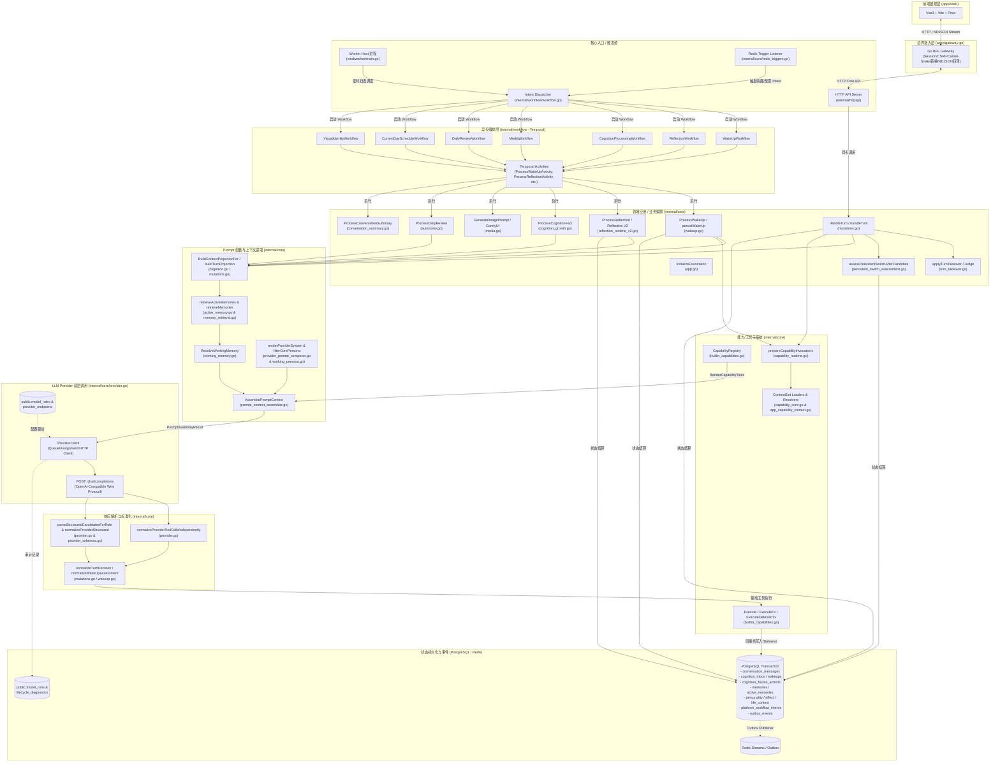
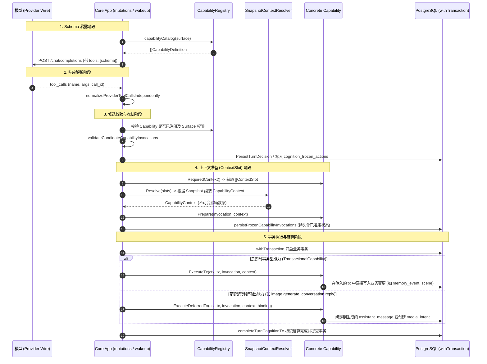

# 摇光系统架构盘点：LLM 子系统及其上下游边界

> 报告生成时间：2026-09-18
> 范围：聚焦于 LLM 子系统及其上下游边界（包括 Provider、Prompt、Slot、Tool、Workflow、Core/Work/BFF 划分与状态副作用）
> 准则：基于代码真实情况，不含推测，不修改任何代码，不给出预设重构方案。

---

# 一、当前真实架构

基于代码实际调用关系（主要位于 [`apps/core-go`](../apps/core-go) 与 [`apps/gateway-go`](../apps/gateway-go)），系统真实架构拓扑如下：



### 关键职责实际分布

| 职责 | 代码所在层与具体位置 | 是否存在多处承担 |
| :--- | :--- | :--- |
| **业务编排** | `internal/core/mutations.go` (`handleTurn`), `internal/core/wakeup.go` (`ProcessWakeUp`), `internal/core/reflection_runtime_v2.go` (`ProcessReflection`) | **是**：同步入口在 `mutations.go`，异步入口全在 `wakeup.go`、`reflection_runtime_v2.go`、`autonomy.go` 中各写一套 |
| **LLM 编排** | `internal/core` 内各业务函数内硬编码调用 | **是**：Main 编排了 1~3 次 LLM 调用（Main + Switch + Continuation + Takeover），全由 `handleTurn` 手写控制流串联 |
| **Prompt 拼装** | `internal/core/prompt_context_assembler.go` (`AssemblePromptContext`) 与 `internal/core/provider_prompt_composer.go` | **是**：存在两套组装逻辑：一套是预算截断组装器（`AssemblePromptContext`），另一套是旧的文本组装器（`composeProviderMessages`） |
| **模型调用** | `internal/core/provider.go` (`ProviderClient`) | **否**：统一收敛在 `ProviderClient.completeWithToolsSchemaMode`，通过 HTTP 调用 OpenAI 兼容接口 |
| **解析模型结果** | `internal/core/provider.go` 与各业务模块中的 `normalize*` | **是**：Provider 层先解析一次 wire JSON/tool_calls；上层业务又分别调用 `normalizeTurnDecision`、`normalizeWakeUpAssessment` 等做二次领域校验 |
| **修改业务状态** | 业务函数内的 `withTransaction(...)`（如 `mutations.go:1184`, `wakeup.go:805`, `reflection_runtime_v2.go:350`） | **是**：每个业务模块各自拥有一个巨大的 PG 事务闭包，直接执行几十条 SQL UPDATE/INSERT |
| **执行 Tool** | `internal/core/capability_runtime.go` 与 `internal/core/builtin_capabilities.go` | **是**：直接执行由 `Capability.Execute` 负责；事务型与延迟型工具由 `ExecuteDeferredTx` 在上层事务内直接被调用 |
| **决定下一步动作** | 业务 Handler（根据模型返回的 `action` 或 `tool_calls`） | **是**：例如 `handleTurn` 中根据 `responseMode == "query_continuation"` 决定是否再发一次请求；根据 `persistentSwitchAssessmentRequired` 决定是否调用人格切换 |

---

# 二、所有 LLM 调用入口盘点

经过对全工程无遗漏搜索，当前共有 **18 处** 触发模型（LLM / Embedding / Vision）调用的实际位置：

| LLM任务 | 入口函数 | 调用链 | Prompt构建位置 | 使用Slot | Tool | 模型调用位置 | Response解析位置 | 是否修改状态 |
| :--- | :--- | :--- | :--- | :--- | :--- | :--- | :--- | :--- |
| **直接对话主认知 (Main)** | `App.HandleTurn` | `HandleTurn` -> `handleTurn` | `internal/core/provider_context.go:56` (`assembleProjectionPromptForSurface`) | 间接通过 ContextProjection 映射；Tool 执行时取 Slot | 有（`CapabilitySurfaceConversation`） | `internal/core/mutations.go:773` (`StructuredAssembledWithToolsSchema`) | `provider.go:392` + `mutations.go:789` (`normalizeTurnDecision`) | **是**（写消息、更新会话 head、更新情绪状态等） |
| **对话查询续接 (Query Continuation)** | `App.HandleTurn` | `handleTurn` -> `query_continuation` 分支 | `internal/core/query_continuation.go:88` (`queryContinuationMessages`) | 无 | 无（明确禁止 Tool） | `internal/core/mutations.go:1117,1144` (`StructuredQueryContinuation`) | `internal/core/query_continuation.go:21` (`continuationVisibleText`) | **是**（保存续接状态，落库最终回复文本） |
| **对话后持久人格切换评估** | `App.assessPersistentSwitchAfterCandidate` | `handleTurn` -> `assessPersistentSwitchAfterCandidate` | `internal/core/persistent_switch_assessment.go:49` | 间接通过 ContextProjection | 无 | `internal/core/persistent_switch_assessment.go:67` (`StructuredAssembledWithToolsSchema`) | `internal/core/persistent_switch_assessment.go:79` | **是**（在后续事务中修改 `active_profile_id`） |
| **人格接管裁决 (Takeover Judge)** | `App.applyTurnTakeover` | `handleTurn` -> `applyTurnTakeover` -> `takeoverJudge` | `internal/core/turn_takeover.go:698` (`buildTakeoverJudgeMessages`) | 间接通过 ContextProjection | 无 | `internal/core/turn_takeover.go:728` (`StructuredAssembledJudgement`) | `internal/core/turn_takeover.go:742` (`decodeTakeoverJudgeResult`) | **否**（纯裁决只读阶段） |
| **人格接管回复生成 (Takeover Reply)** | `App.applyTurnTakeover` | `handleTurn` -> `applyTurnTakeover` -> `generateTakeoverReply` | `internal/core/turn_takeover.go:900` (`assembleProjectionPromptForSurface`) | 间接通过 ContextProjection | 有（`CapabilitySurfaceConversation`） | `internal/core/turn_takeover.go:915` (`StructuredAssembledWithToolsSchema`) | `internal/core/turn_takeover.go:933` + `normalizeTurnDecision` | **是**（替代原候选者写入冻结状态） |
| **主动唤醒 (WakeUp)** | `App.ProcessWakeUp` | `Temporal ProcessWakeUpActivity` -> `ProcessWakeUp` | `internal/core/wakeup.go:485` (`assembleProjectionPromptForSurface`) | 间接通过 ContextProjection；Tool 执行时取 Slot | 有（`CapabilitySurfaceWakeUp`） | `internal/core/wakeup.go:497` (`StructuredAssembledWithToolsSchema`) | `internal/core/wakeup.go:526` (`normalizeWakeUpAssessment`) | **是**（落库 `cognition_wakeups`、排期下次唤醒、调度反思） |
| **演化反思 (Reflection V2)** | `App.ProcessReflection` | `Temporal ProcessReflectionActivity` -> `ProcessReflection` | `internal/core/reflection_runtime_v2.go:167` (`assembleProjectionPromptForSurface`) | 间接通过 ContextProjection | 无（纯结构化建议） | `internal/core/reflection_runtime_v2.go:174` (`StructuredAssembledWithToolsSchema`) | `internal/core/reflection_runtime_v2.go:205` (`DecodeReflectionProposalV2`) | **是**（修改 memories, affect, goals, overlays, watermark） |
| **每日回顾 (Daily Review)** | `App.ProcessDailyReview` | `Temporal ProcessDailyReviewActivity` -> `ProcessDailyReview` | `internal/core/autonomy.go:76` (`assembleProjectionPromptForSurface`) | 间接通过 ContextProjection | 有（`CapabilitySurfaceWakeUp`） | `internal/core/autonomy.go:88` (`StructuredAssembledWithToolsSchema`) | `internal/core/autonomy.go:102` (`normalizeDailyReviewAssessment`) | **是**（更新 daily review 事实与计划） |
| **原生认知/自主成长 (Native Cognition)** | `App.ProcessCognitionFact` | `Temporal ProcessCognitionActivity` -> `ProcessCognitionFact` | `internal/core/cognition_growth.go:357` (`assembleProjectionPromptForSurface`) | 间接通过 ContextProjection | 有（`CapabilitySurfaceConversation`） | `internal/core/cognition_growth.go:370` (`StructuredAssembledWithToolsSchema`) | `internal/core/cognition_growth.go:384` (`normalizeNativeCognitionAssessment`) | **是**（结算事实、更新内部状态） |
| **对话摘要生成 (Conversation Summary)** | `App.ProcessConversationSummary` | `Temporal ProcessConversationSummaryActivity` -> `ProcessConversationSummary` | `internal/core/conversation_summary.go:268` (`messages` 切片组装) | 无 | 无 | `internal/core/conversation_summary.go:267` (`StructuredWithSchema`) | `internal/core/conversation_summary.go:283` (`digestTextFromStructured`) | **是**（写入 `conversation_summaries` 表） |
| **日程生成 (Schedule Generation)** | `App.generateDaySchedule` | `EnsureCurrentDaySchedule` -> `generateDaySchedule` | `internal/core/schedule_generation.go:28` | 无 | 无 | `internal/core/schedule_generation.go:32,42` (`StructuredWithSchema`) | `internal/core/schedule_generation.go:48` (`normalizeSchedulePlan`) | **是**（保存到 `daily_schedules` 表） |
| **媒体提示词生成 (Media Prompt)** | `App.GenerateImagePrompt` | `ProcessMediaActivity` -> `GenerateImagePrompt` | `internal/core/media.go:89` (`system` + `user` 字符串拼接) | 无 | 无 | `internal/core/media.go:89` (`Text`) | `internal/core/media.go:94` (`normalizeMediaPromptOutput`) | **否**（纯生成文本，下游任务消费） |
| **媒体质量验收 (Media Quality)** | `App.EvaluateMediaQuality` | `ProcessMediaActivity` -> `EvaluateMediaQuality` | `internal/core/media_quality.go:153` (`buildMediaQualityEvaluationMessages`) | 无 | 无 | `internal/core/media_quality.go:159` (`StructuredWithSchema`) | `internal/core/media_quality.go:164` (`normalizeMediaQualityEvaluation`) | **是**（记录媒体质量审计数据） |
| **视觉身份分析 (Visual Identity Vision)** | `App.InspectVisualIdentityCandidate` | `ProcessVisualIdentityActivity` -> `InspectVisualIdentityCandidate` | `internal/core/visual_identity.go:878` (`messages` 硬编码) | 无 | 无 | `internal/core/visual_identity.go:878` (`StructuredWithSchema`) | `internal/core/visual_identity.go:881` | **否**（纯图像质检） |
| **视觉身份补丁 (Visual Identity Patch)** | `App.PatchVisualIdentity` | `ProcessVisualIdentityActivity` -> `PatchVisualIdentity` | `internal/core/visual_identity.go:902` (`messages` 硬编码) | 无 | 无 | `internal/core/visual_identity.go:902` (`StructuredWithSchema`) | `internal/core/visual_identity.go:905` | **是**（修改 visual identity 状态） |
| **记忆嵌入 (Memory Embedding)** | `App.EmbedMemory` | `ProcessMemoryEmbeddingActivity` -> `EmbedMemory` | 无（输入原始文本） | 无 | 无 | `internal/core/memory_embedding.go:47` (`embedWithAssignment`) | 向量直接解析 | **是**（写入 `memories` 的 embedding 向量列） |
| **记忆检索向量计算 (Retrieval Embedding)** | `App.RetrieveMemories` | 检索计划生成后 -> `Embed` | 无（输入检索 query 文本） | 无 | 无 | `internal/core/memory_retrieval.go:419` (`Embed`) | 向量直接解析 | **否**（纯内存向量用于 pgvector 计算） |
| **白纸创建/初始化 (Initialization)** | `App.InitializeFoundation` | API `POST /api/fluctlights/initialize` -> `InitializeFoundation` | `internal/core/app.go:327` (`providerInitializationRuntimeProtocol`) | 无 | 无 | `internal/core/app.go:331` (`Structured`) | `internal/core/app.go:335` (`normalizeFoundationPreview`) | **否**（只返回 preview，待用户确认后才落库） |

---

# 三、分析 LLM Provider 层

当前真正向模型发送网络请求的代码位于 `internal/core/provider.go`。

### 1. 是否存在统一 LLM Client / Provider abstraction？
**不存在 Go `interface` 抽象**。全工程只有唯一的具体结构体 `type ProviderClient struct`（`internal/core/provider.go:21-30`），挂载在 `App.Provider` 上。

### 2. OpenAI / Claude / Gemini / 本地模型等是否有统一接口？
**没有**。代码在 HTTP 传输层面仅硬编码实现了 **OpenAI-Compatible Wire Protocol**（向 `assignment.BaseURL + "/chat/completions"` 和 `"/embeddings"` 发送 POST JSON 请求）。没有任何针对 Claude、Gemini 等原生协议的 Provider 适配器；接入外部模型全部依赖对方提供 OpenAI 兼容格式或前置反向代理。

### 3. model、temperature、max token、response format 等参数在哪里决定？
- **model / timeout / context_window / max_input / token_budget**：在运行时从数据库表 `public.model_roles` 关联 `public.provider_endpoints` 动态查询得到（见 `provider.go:87` `assignment()`）。
- **max token (output reserve)**：由 `assignment.TokenBudget` 决定；但在 `initialization` 场景下，代码强制覆盖为最小值 `8192`（见 `provider.go:57` `providerAssignmentForScenario`）。
- **temperature**：未暴露在 `model_roles` 表中，payload 中未设置显式 temperature，完全依赖模型默认值。
- **response format**：在 `provider.go:999` `providerResponseFormatForSchema` 中根据传入的 `schemaName` 和 `schema` 构造 `type: "json_object"` 或 JSON Schema。

### 4. retry / timeout / fallback 在哪里处理？
- **timeout**：在 `assignment.Timeout` 中指定，每次请求通过 `context.WithTimeout(runCtx, assignment.Timeout)` 实施（见 `provider.go:316`）。
- **retry**：`ProviderClient` 内部**没有 HTTP 级别的自动重试机制**！网络错误或 HTTP 非 200 会直接记录失败并返回 error。重试交由上层 Temporal Workflow（如 `RetryPolicy{MaximumAttempts: 2}`）或前端重新发起。
- **fallback**：
  - 角色降级：当特定角色未配置时，SQL 查询中会 fallback 到 `generic_llm`（见 `provider.go:100`）。
  - 结构化兜底：当模型输出的 JSON 无法解析或缺少字段时，触发 `emptyProviderStructured`（见 `provider.go:432`），并将 `completion.StructuredFallback` 设为 `true`。

### 5. structured output 在哪里处理？
全在 `internal/core/provider.go` 中处理：
- 兼容处理：专门适配本地模型（如 mlx-serve）将 JSON 输出在 `reasoning_content` 中而 `message.content` 为空的情况（`provider.go:388-392`）。
- 提取 sidecar：`providerStructuredCandidates` 遍历 `content`、`reasoning_content`、markdown 代码块。
- 解析与补全：调用 `parseStructuredCandidatesForRole` 与 `normalizeProviderStructured` 对齐 schema。

### 6. tool calling 在哪里处理？
- Request 构建：在 `provider.go:965` 中将 `CapabilityDefinition` 渲染为 OpenAI 格式的 `tools: [{"type": "function", "function": ...}]`。
- Response 提取：在 `provider.go:369` 中解析 wire 返回的 `message.tool_calls`，同时还支持从 JSON 结构体中的 `tool_calls` 字段中提取结构化工具调用（双通道容错）。

### 7. streaming 在哪里处理？
- 底层实现：`provider.go:1200` 存在 `StreamText` 方法，通过 SSE 读取 chunk。
- **业务实际情况**：**业务层根本没有使用 `StreamText`！** 直接对话 Main 的 LLM 调用是完全非流式的（`StructuredAssembledWithToolsSchema`），等模型完整生成、结构化解析、工具验证、数据库事务全部提交之后，在 `mutations.go:1274` 一次性将完整的 `visible` 文本传给 `callbacks.onChunk(visible)`，向 BFF 发出单帧 NDJSON。

### 8. 调用日志、token usage、trace 在哪里处理？
- 在 `provider.go:309-315` 中，每次调用前向 PostgreSQL 的 `public.model_runs` 表插入一条状态为 `queued` 的记录；请求结束时更新 prompt metrics、token usage 与耗时。
- 成功/失败记录：通过 `recordProviderSuccess` 和 `recordProviderFailure` 落库审计。

### 9. 上层业务是否直接依赖某个 Provider 的 SDK/API 数据结构？
上层业务**没有使用官方 OpenAI SDK**，但直接强依赖了 `internal/core/provider.go` 中自建的结构：
- `ProviderCompletion`（包含 `Text`, `Structured`, `ToolCalls`, `StructuredFallback`）
- `CapabilityDefinition`
- `ProviderContextSurface`
- `providerAssignment`

### 核心 Interface / Struct / Function
- 核心结构体：`core.ProviderClient` (`internal/core/provider.go:21`)
- 核心调用方法：
  - `StructuredAssembledWithToolsSchema`
  - `StructuredWithSchema`
  - `StructuredQueryContinuation`
  - `StructuredAssembledJudgement`
  - `StreamText`
  - `Embed` / `embedWithAssignment`

### 收敛为统一 LLMClient 的迁移分析

> 如果要把模型调用最终收敛为类似：
> ```go
> type LLMClient interface {
>     Generate(ctx context.Context, req *LLMRequest) (*LLMResponse, error)
>     Stream(ctx context.Context, req *LLMRequest) (...)
> }
> ```

- **可以直接复用的部分**：
  1. `prompt_context_assembler.go` 中的预算计算、token 估算与消息截断逻辑；
  2. `RenderCapabilityTools`（从领域 Capability 到 OpenAI Tool Schema 的转换器）；
  3. `public.model_roles` 与 `public.provider_endpoints` 的数据库配置读取逻辑；
  4. `model_runs` 审计记录机制。
- **迁移障碍与阻力**：
  1. **Thinking / Reasoning Content 耦合**：当前代码在 HTTP 层面直接嗅探 `choice.message["reasoning_content"]` 并尝试将其作为 JSON candidate 解析。统一抽象必须明确 Reasoning 与 Content 的通道定义。
  2. **Tool-Call 混合解析机制**：当前代码同时支持原生 wire `tool_calls` 和 JSON body 内的 `tool_calls` 伪指令（双解析路径），并自动补全 `call_id`。统一 Client 若只认标准 tool_calls，可能会破坏本地小模型的兼容逻辑。
  3. **并发排队与 Redis 锁**：当前 `runProviderQueued` 将进程级 / 跨进程的并发控制与队列调度死死绑在 `ProviderClient` 内部。统一接口必须把“并发排队”与“模型网络请求”解耦。
  4. **Direct Context 注入**：当前 Provider 方法直接从 context 中取 `providerPromptDiagnostics`、`providerCancellationMarker` 等特定领域 key，并就地向诊断表写数据，违反了无业务语义原则。

---

# 四、分析 Prompt 系统

### Prompt 构建机制判断
当前系统的 Prompt 构建机制为：**E. 多种机制混用（以“基于固定预算的片段装配器”为主线，混杂字符串硬编码与模板式注入）**。

其骨架并非传统 LangChain 式的纯 Template 渲染，而是一套**基于预算（Budget Policy）的分层优先级装配流水线**：
1. 先通过领域投影 `ContextProjection` 聚合当前所有的 Agent 事实；
2. 过滤掉被该 Surface 禁用的上下文（如 Reflection 禁用近期历史）；
3. 转化为带 `Priority` 的 `PromptFragment`（Runtime Fact, Active Memory, Retrieved Memory, Summary, Recent Message）；
4. 通过 `AssemblePromptContext`（`internal/core/prompt_context_assembler.go:241`）按照预算空间进行硬性排序、筛选和截断（B-layout）；
5. 最终生成：
   - 1 条 `system` 消息（包含系统协议规则 + Core Persona）
   - 1 条 `user` 消息（包含 `[RUNTIME CONTEXT]` 序列化 JSON）
   - N 条 `user` / `assistant` 近期消息
   - 1 条当前输入 `user` 消息

### 真实调用关系图

```text
某次 Main 调用：

App.HandleTurn
 └─► buildTurnProjection
      ├─► DB: 读取 CorePersona, CurrentState, LifeContext, Schedule, Relationship
      └─► Memory: retrieveMemories (pgvector)
 └─► assembleProjectionPromptForSurface (ProviderContextSurfaceConversationMain)
      ├─► retrieveActiveMemories (ActiveMemory 读时过滤)
      ├─► retrieveConversationSummaries (历史摘要)
      ├─► workingMemoryInputFromProjectionForSurface (转为 PromptFragment 候选集)
      ├─► ResolveWorkingMemory (WorkingMemory 优先级排序)
      └─► AssemblePromptContext (严格受限于 TokenBudget)
           ├─► renderProviderSystem (拼装 OperationRules + CorePersona)
           ├─► [RUNTIME CONTEXT] User Message (序列化 WorkingMemory 事实)
           ├─► RecentMessages (保留历史对话角色)
           └─► CurrentInput (用户本次输入)
 └─► ProviderClient.StructuredAssembledWithToolsSchema
      └─► POST /chat/completions
```

### 三条完整 Prompt 构建链对比

#### 1. Main (直接对话) 构建链
- **触发入口**：`internal/core/mutations.go:762`
- **Surface**：`ProviderContextSurfaceConversationMain`
- **System 内容**：
  - 静态规则：`providerContextAuthorityRule` + `capabilityConversationPolicyInstruction` + `providerRuntimeProtocol`
  - 角色设定：`systemPersonaForProjection` 提取的 Core Persona（若有多重人格，注入当前 `active_profile_id` 及其 `behavior_policy`、`voice`、`expression`）
- **Runtime Context (`[RUNTIME CONTEXT]`)**：
  - `RuntimeFacts`：`current_state`, `current_life`, `schedule`, `presence`, `relationships`, `drive/preferences`
  - `ActiveCandidates`：未过期的短期承诺、近期事实
  - `RetrievedMemories`：针对用户输入从长期记忆召回的 Episodic/Semantic 记忆（带 opaque ref）
  - `Summaries`：会话的历史摘要
- **对话历史**：允许注入最近 N 轮对话历史（保留原 transport role）
- **Current Input**：用户的当前发话文本
- **Tools**：带入全部 `CapabilitySurfaceConversation` 工具 schema（`conversation.reply`, `image.generate`, `scene.event`, `memory.recall` 等）
- **Wire Schema**：`conversation_turn_response`（带 thinking）

#### 2. Reflection (演化反思) 构建链
- **触发入口**：`internal/core/reflection_runtime_v2.go:167`
- **Surface**：`ProviderContextSurfaceReflection`
- **System 内容**：
  - 静态规则：`providerContextAuthorityRule` + `reflectionV2Instruction`（明确告知模型：当前在进行演化反思，不要对话，只提出修订提案）
  - 角色设定：Core Persona
- **Runtime Context (`[RUNTIME CONTEXT]`)**：
  - 包含 `current_state`, `developing_self`, `personality_system`, `goals`, `intentions`, `drives`
  - **禁绝项**：明确**禁用近期原始对话历史**（`providerContextSurfaceAllowsRecentHistory = false`）和摘要（`providerContextSurfaceAllowsSummaries = false`），防止模型把闲聊当作长期事实演化
- **Current Input**：被裁剪后的 `evidence` 窗口（由之前的 ActionOutcome、Fact 聚合而成的 JSON 字符串）
- **Tools**：**无 Tool**（工具 schema 为空）
- **Wire Schema**：`reflection_proposal_v2`（带 thinking）

#### 3. WakeUp (主动唤醒) 构建链
- **触发入口**：`internal/core/wakeup.go:485`
- **Surface**：`ProviderContextSurfaceWakeUp`
- **System 内容**：
  - 静态规则：`providerContextAuthorityRule` + `capabilityWakeUpPolicyInstruction`
  - 角色设定：Core Persona + 当前 Active Profile
- **Runtime Context (`[RUNTIME CONTEXT]`)**：
  - 包含内部情绪动力学、Presence、当前日程进度、生活上下文、缺失视觉身份标记（`visual_identity["missing"] = true`）
  - 包含 Active Memory 与长期记忆
  - 允许带入与当前直接会话关联的近期历史
- **Current Input**：结构化的唤醒上下文 JSON（包含 `wake_up_id`, `cycle`, `schedule_status`）
- **Tools**：带入 `CapabilitySurfaceWakeUp` 工具集合（包含 `moment.publish`, `conversation.reply`, `visual_identity.initialize`, `schedule.replan` 等）
- **Wire Schema**：`wake_up_response`（带 thinking）

---

# 五、盘点 Slot

### 核心事实澄清：当前项目中的 Slot 到底是什么？
在当前代码库中，**命名为 Slot 的实体不是“Prompt 填充插槽”，而是“Capability (Tool) 的执行上下文隔离插槽” (`ContextSlot`)**。

其定义位于 `internal/core/capability_core.go:89-102`：
```go
// ContextSlot is a typed request for execution context. A capability should
// declare the smallest set of slots it needs rather than reading App state directly.
type ContextSlot string

const (
    SlotCorePersona       ContextSlot = "core_persona"
    SlotCurrentState      ContextSlot = "current_state"
    SlotCurrentLife       ContextSlot = "current_life"
    SlotSchedule          ContextSlot = "schedule"
    SlotVisualIdentity    ContextSlot = "visual_identity"
    SlotAppearance        ContextSlot = "appearance"
    SlotRelationshipScope ContextSlot = "relationship_scope"
    SlotMemoryScope       ContextSlot = "memory_scope"
    SlotAgency            ContextSlot = "agency"
    SlotRecentOutcomes    ContextSlot = "recent_outcomes"
)
```
设计的本意是：**Capability 在执行前通过 `RequiredContext() []ContextSlot` 声明它需要什么上下文，运行时通过 Resolver 拍下一个不可变快照，避免 Tool 直接任意访问全局 DB 或全局 App 状态**。

### 所有 ContextSlot 盘点清单

| ContextSlot | 数据来源 (DB 表 / 字段) | 谁写入 | 谁读取 | 是否持久化 | Prompt是否直接使用 | 其他消费者 |
| :--- | :--- | :--- | :--- | :--- | :--- | :--- |
| `SlotCorePersona` | `fluctlights.core_persona` | 创建实例 / Revision 治理 | `loaderCorePersona` | 是 | 否（Prompt 从 Projection 读） | `image.generate`, `visual_identity.initialize` |
| `SlotCurrentState` | `fluctlight_current_states` | 认知结算事务、Affect Reducer | `loaderCurrentState` | 是 | 否 | 状态校验、Capability Context |
| `SlotCurrentLife` | `fluctlight_life_contexts` | Life Context 治理接口、事件变更 | `loaderCurrentLife` | 是 | 否 | `conversation.reply`, `scene.event` |
| `SlotSchedule` | `daily_schedules` | Schedule Replan、午夜生成任务 | `loaderSchedule` | 是 | 否 | `schedule.replan` |
| `SlotVisualIdentity` | `visual_identities` | 视觉身份初始化与审查流水线 | `loaderVisualIdentity` | 是 | 否 | `image.generate`, 提示词填充 |
| `SlotAppearance` | `fluctlight_life_contexts.appearance` | Life Context 治理接口 | `loaderAppearance` | 是 | 否 | 图像生成能力 |
| `SlotRelationshipScope` | `relationship_overrides` | 关系变更、Reflection V2 | `loaderRelationshipScope` | 是 | 否 | 鉴权与受访权限过滤 |
| `SlotMemoryScope` | `memories` | Reflection V2, Memory Event | `loaderMemoryScope` | 是 | 否 | `memory.recall` 范围边界检查 |
| `SlotAgency` | `fluctlights.agency_level` 等 | 治理修改 | `loaderAgency` | 是 | 否 | 自治权限检查 |
| `SlotRecentOutcomes` | `cognition_action_outcomes` | Capability 执行结束结算 | `loaderRecentOutcomes` | 是 | 否 | 动作回溯与重试 |

### 当前 Slot 的概念归属判定
当前 Slot 本质属于：**Capability Execution Context Snapshot（能力执行期的沙箱快照契约）**。
它既不是 Agent 的内部状态机，也不是 Prompt 模板插槽，但**它提取的数据源与 Prompt 组装所需的数据源（ContextProjection）高度重叠**。

### 是否存在闭环状态修改链路？
**代码中存在真实的闭环路径**，但中间承载体是 `ContextProjection` 和 `cognition_frozen_actions`，其路径为：
```text
DB 领域状态
 └─► App.buildTurnProjection / BuildContextProjectionFor 读取状态生成 ContextProjection
      └─► AssemblePromptContext 组装成 Prompt
           └─► LLM 输出 decision 与 tool_calls
                └─► prepareCapabilityInvocations 解析 Tool 所需 ContextSlot，冻结到 frozen_action.payload
                     └─► 事务中调用 Capability.ExecuteTx / ExecuteDeferredTx 修改 DB 状态
                          └─► 事务中调用 applyFrozenCognitiveStagesTx 更新情绪/内部状态
                               └─► 下一轮对话读取到已修改的状态！
```

---

# 六、分析不同 LLM 任务现在如何组织

### 任务区分与组织现状

```text
                                 [请求/事件入口]
                                        │
           ┌────────────────────────────┴────────────────────────────┐
           ▼                                                         ▼
     [同步直接对话]                                             [异步背景任务]
           │                                                         │
   mutations.go: HandleTurn                                   cmd/worker/main.go
           │                                                         │
           ├─► takeoverJudge (if takeover_chain)                     │
           ├─► takeoverReply (if approved)                           │
           ├─► query_continuation (if pure query)                    │
           ├─► assessPersistentSwitchAfterCandidate (if switchable)   │
           └─► 标准 Main                                             ▼
                                                      platform_workflow_intents 表
                                                                     │
                                                      Dispatcher: switch intent.type
                                                                     │
                                          ┌──────────────────────────┼──────────────────────────┐
                                          ▼                          ▼                          ▼
                                   WakeUpWorkflow           ReflectionWorkflow          MediaWorkflow
                                          │                          │                          │
                                   ProcessWakeUpActivity    ProcessReflectionActivity   ProcessMediaActivity
                                          │                          │                          │
                                       wakeup.go              reflection_runtime_v2.go       media.go
```

1. **哪些代码共享**：
   - **底层 HTTP 调用**：全部共享 `ProviderClient.completeWithToolsSchemaMode`。
   - **Prompt 截断组装**：Main、WakeUp、Reflection、DailyReview、NativeCognition 共享 `assembleProjectionPromptForSurface` 和 `AssemblePromptContext`。
   - **Tool 注册表与定义**：Main、WakeUp、DailyReview 共享 `builtinCapabilities(app)`。
   - **审计与指标**：全部共享 `recordQueuedModelRun` 和 `model_runs` 表。
2. **哪些代码复制**：
   - **LLM 返回值提取与校验**：`normalizeTurnDecision`（Main）、`normalizeWakeUpAssessment`（WakeUp）、`normalizeDailyReviewAssessment`（Review）虽然逻辑大同小异（都是检查 action、检查 tool_calls、校验 visible_text、冻结 influence），但各自独立实现了一整套结构体和转换代码。
   - **事务持久化闭包**：`withTransaction` 内的状态落库逻辑在 `mutations.go`、`wakeup.go`、`reflection_runtime_v2.go` 中各写了数百行高度相似的 SQL UPDATE。
3. **哪些通过 if / switch 区分**：
   - **角色与配置映射**：`provider.go:100` 数据库 SQL 中通过 `ORDER BY CASE WHEN r.role = $1 ...` 决定优先级。
   - **Thinking 开启白名单**：`provider.go:211` `structuredThinkingEnabledForSchema` 通过 `switch strings.TrimSpace(schemaName)` 硬编码匹配。
   - **Surface 规则裁剪**：`provider_context.go:170,179` `switch surface` 决定是否暴露近期历史和摘要。
   - **异步意图分发**：`internal/workflow/workflow.go:1320-1370` `Dispatcher.dispatchIntent` 中按 `intent.IntentType` 做 switch。
4. **哪些有独立 Handler**：
   - Main：`mutations.go: handleTurn`
   - WakeUp：`wakeup.go: ProcessWakeUp`
   - Reflection：`reflection_runtime_v2.go: ProcessReflection`
   - Daily Review：`autonomy.go: ProcessDailyReview`
   - Native Cognition：`cognition_growth.go: ProcessCognitionFact`
   - Media Prompt：`media.go: GenerateImagePrompt`
   - Conversation Summary：`conversation_summary.go: ProcessConversationSummary`
5. **哪些散落在业务代码**：
   - 对话中的查询续接（`query_continuation`）：散落在 `handleTurn` 的状态分支中。
   - 对话中的接管裁决（Takeover Judge）：在 `applyTurnTakeover` 中就地组装 Prompt 并调用。
   - 对话后的人格切换评估（Persistent Switch）：在 `handleTurn` 生成 candidate 后就地直接调用。

---

# 七、Tool Calling

### 完整 Tool 生命周期时序图



### 关键细节回答
1. **Tool Registry 在哪里**：
   在 `internal/core/capability_runtime.go:17` 定义 `CapabilityRegistry`；在 `internal/core/builtin_capabilities.go:73` 的 `builtinCapabilities(app)` 统一注册所有内置工具。
2. **Tool Schema 在哪里**：
   由各 Capability 的 `Definition()` 方法提供，集中在 `internal/core/tool_contract.go` 定义具体入参 schema、描述、副作用分类与所属 Surface。
3. **Tool Executor 在哪里**：
   各个 Capability 结构体自身实现 `Capability.Execute` 或 `TransactionalCapability.ExecuteTx`，主要位于 `internal/core/builtin_capabilities.go`。
4. **Tool 与业务 Service 是否直接耦合**：
   **高度直接耦合**。在 `builtin_capabilities.go` 中，大部分 Capability（如 `imageGenerateCapability`、`sceneEventCapability`、`memoryEventCapability` 等）都把 `service: app`（即 `*core.App`）作为依赖直接注入，在工具执行时直接调用 `app` 上的业务修改方法。
5. **Tool 是否能独立于 Workflow 使用**：
   **可以，且实际上主要独立于 Workflow 使用**。在直接对话（`HandleTurn`）中，Tool 是在 HTTP 请求处理线程中由 Core 直接解析、准备并在同一 DB 事务中同步执行的，完全不经过 Temporal Workflow。
6. **Tool 调用后是否直接修改 Agent State**：
   **是**。例如 `scene.event` 会直接修改 Life Context 的 scene；`memory.event` 会直接插入持久记忆；`affect.event` 会直接驱动 Affect Reducer 修改情绪状态。
7. **是否存在 Tool → Workflow → LLM → Tool 的循环调用**：
   **不存在无限循环调用**，但存在受控的跨阶段异步调用：例如 `image.generate` 工具执行时只落库一条 `media.generation` 的 `platform_workflow_intent`；随后 Temporal Worker 拾取该 intent 启动 `MediaWorkflow`，在 Activity 中再次调用 LLM 生成提示词并调用 ComfyUI。

---

# 八、Workflow 重点分析

### Workflow 当前职责判断

| 职责项 | 是否由 Temporal Workflow 负责 | 真实代码事实 |
| :--- | :---: | :--- |
| **生命周期控制 (Pause/Resume)** | **是** | `registerWorkflowControl` 监听 Temporal Signal 实现暂停/恢复 |
| **LLM 调用编排** | **否** | Workflow 只调用 Activity，Activity 只是透传调用 `core.App` 上的单次业务方法 |
| **Prompt 构建** | **否** | 完全由 `internal/core` 负责，Workflow 完全不感知 Prompt |
| **Tool 调度** | **否** | Tool 解析与执行在 Core 内部完成 |
| **状态机维护** | **部分负责** | 维护 Workflow 自身的运行/重试状态；但领域业务状态（Cognition/Turn）状态机由 PG 表驱动 |
| **Agent 行为决策** | **否** | 全部由 Core 内的 LLM Prompt + 领域规则裁决 |
| **DB Transaction** | **否** | Temporal Activity 内调用 `core.App`，由 Core 开启短 PostgreSQL 事务 |
| **Event 消费与发布** | **否** | 由 Worker 进程中的 Redis Streams Consumer / Outbox Publisher 负责 |
| **定时调度 (Cron/Timer)** | **是** | 午夜刷新（`workflow.Sleep(ctx, delay)`）、长周期重试 |
| **长任务失败重试** | **是** | Temporal Activity RetryPolicy（如 ComfyUI 图像生成失败重试） |
| **多步骤异步长作业** | **是** | 视觉身份生成（`VisualIdentityWorkflow`）跨多个轮询和补丁步骤 |

### Workflow 最核心文件与函数清单
1. `internal/workflow/workflow.go:85` `app()`：从全局 runtime 读取 `*core.App`。
2. `internal/workflow/workflow.go:180` `VisualIdentityWorkflow`：视觉身份多阶段生成/验证工作流。
3. `internal/workflow/workflow.go:212` `WakeUpWorkflow`：周期唤醒 Temporal 包装器。
4. `internal/workflow/workflow.go:536` `ReflectionWorkflow`：演化反思 Temporal 包装器。
5. `internal/workflow/workflow.go:378` `MediaWorkflow`：ComfyUI 异步生成与轮询工作流。
6. `internal/workflow/workflow.go:403` `CurrentDayScheduleWorkflow`：定时 sleep 到午夜的日程守护流。
7. `internal/workflow/workflow.go:604` `ProcessWakeUpActivity`：唤醒 Activity，转调 `app.ProcessWakeUp`。
8. `internal/workflow/workflow.go:739` `ProcessReflectionActivity`：反思 Activity，转调 `app.ProcessReflection`。
9. `internal/workflow/workflow.go:1320` `Dispatcher.dispatchIntent`：将 DB 中的 Intent 转换为 Temporal 执行。

### 关键问题回答

> **如果完全移除 Workflow，当前哪些能力会直接丢失？**
1. **ComfyUI 异步任务的确定性重试与状态恢复**（生图耗时长、可能遇到 ComfyUI 重启，Temporal 保证作业不丢失）；
2. **到午夜自动触发明日日程生成的心跳机制**（`CurrentDayScheduleWorkflow` 依赖 Temporal 的长 sleep）；
3. **视觉身份初始化流水线的多步恢复**（`VisualIdentityWorkflow` 经历“生图 -> 轮询 -> 视觉质检 -> 补丁”，跨分钟级别运行）；
4. **外部治理对长异步任务的暂停/恢复/取消信号（Signal/Cancel）**。

> **哪些 Workflow 实际只是“普通应用层 orchestration”？**
- **`WakeUpWorkflow`**：内部仅仅是 `ExecuteActivity(ProcessWakeUpActivity)`，Activity 直接调用 `app.ProcessWakeUp()`，而 `ProcessWakeUp` 内部自己完成了读取、组装、调用 LLM、事务落库、计算下次唤醒时间的全部逻辑。这个 Workflow 几乎就是一个单步 Remote Task Wrapper。
- **`ReflectionWorkflow`**：同上，内部仅仅单步执行 `ProcessReflectionActivity` -> `app.ProcessReflection()`。
- **`CognitionProcessingWorkflow`**：单步执行 `ProcessCognitionActivity` -> `app.ProcessCognitionFact()`。
- **`ConversationSummaryWorkflow`**：单步执行 `ProcessConversationSummaryActivity`。
- **`MemoryEmbeddingWorkflow`**：单步执行 `ProcessMemoryEmbeddingActivity`。

> **哪些 Workflow 确实具有状态机、暂停恢复、重试、多阶段执行等特征？**
- **`VisualIdentityWorkflow`**：具有真正的多阶段执行（Phase 1 生成 -> Phase 2 质检 -> Phase 3 补丁）、心跳上报与状态机。
- **`MediaWorkflow`**：具有真实的外部任务轮询、错误分类与指数退避重试。
- **`CurrentDayScheduleWorkflow`**：跨越 24 小时自然日的时间状态流。

---

# 九、分析 Core / Work / Workflow 真实边界

### 真实 Import / Call Graph

```text
cmd/api (Core API Process)
 └─► internal/httpapi
      └─► internal/core (App)
           └─► internal/platform (Outbox)

cmd/worker (Worker Process)
 ├─► internal/core (App)
 ├─► internal/workflow (Temporal Workflows & Activities)
 │    └─► internal/core (通过全局 app() 变量反向回调)
 └─► internal/platform (Event Consumers & Outbox Publisher)
```

- **`core -> ...`**：`internal/core` **完全没有 import `internal/workflow`**。Core 将异步工作写入 PostgreSQL 的 `platform_workflow_intents` 表，并通过 SQL 轮询更新状态。
- **`work -> ...`**：`cmd/worker/main.go` 充当**组合根（Composition Root）**，同时 import 了 `core`、`workflow`、`platform`、`config`，负责实例化各组件并互相注入。
- **`workflow -> ...`**：`internal/workflow` **直接 import 了 `internal/core`**，并且严重依赖一个包级全局变量 `var runtime struct { app *core.App }`（`internal/workflow/workflow.go:37`），Activity 执行时通过 `app()` 反向调用 Core 的各种业务逻辑。

### 违反边界的典型代码证据

1. **Workflow 依赖全局变量回调 Core**：
   `internal/workflow/workflow.go:85`：
   ```go
   func app() *core.App { runtime.RLock(); defer runtime.RUnlock(); return runtime.app }
   ```
   所有 Activity 没有通过显式的接口或参数传递依赖，而是直接读取全局单例 `app()`。
2. **Core 承担所有层次的职责，没有内部的分层解耦**：
   在 `internal/core` 这单一 package 下，聚集了 100 多个文件：
   - 包含 HTTP 参数解析辅助
   - 包含 PostgreSQL SQL 拼装和事务管理
   - 包含 LLM 协议转换和网络请求（`provider.go`）
   - 包含 Prompt 截断算法（`prompt_context_assembler.go`）
   - 包含具体的 Tool 业务实现（`builtin_capabilities.go`）
   整个 `internal/core` 既是 Domain Layer，又是 Infrastructure Layer，还是 Application UseCase Layer。
3. **Prompt Composer 混杂状态解析与清洗**：
   `internal/core/provider_prompt_composer.go:57-89`：`composeProviderMessages` 在准备发送给模型的 Prompt 时，在字符串和 JSON 之间来回反序列化，从系统消息中强行提取 `actor_relationship_context` 和 `core_persona` 并修改 map 结构。
4. **LLM Parser 直接决定业务状态降级**：
   `internal/core/provider.go:432`：当底层网络返回的 JSON 无法解析时，Provider 内部直接构造了业务领域的“空兜底结构体”（`emptyProviderStructured`），侵入了领域决策。
5. **BFF 边界干净，未违反职责**：
   `apps/gateway-go` 没有直接访问数据库或模型，严格通过 HTTP 转发给 Core，契约保持良好。

---

# 十、状态修改路径（端到端追踪）

### 1. Main (直接对话一次交互)
```text
输入 (HTTP POST /internal/conversations/{id}/turns: text, actor_id, idempotency_key)
 ↓
读取哪些状态:
 - 读取 public.conversation_messages / conversation_heads 校验幂等与序号
 - 读取 public.fluctlights 获取实例详情
 - 读取 public.fluctlight_current_states, life_contexts, daily_schedules, relationship_overrides, presence
 - pgvector 检索 public.memories (长期记忆)
 - 读取 public.active_memories (有效承诺/事件)
 - 读取 public.conversation_summaries (历史摘要)
 ↓
调用哪些模块:
 - mutations.go: handleTurn
 - cognition.go: buildTurnProjection
 - prompt_context_assembler.go: AssemblePromptContext
 - provider.go: StructuredAssembledWithToolsSchema
 ↓
LLM (cognitive_assessment 角色, schema: conversation_turn_response)
 ↓
解析:
 - provider.go: 提取 tool_calls, 解析 JSON candidate, 校验 schema
 - mutations.go: normalizeTurnDecision, normalizeVisibleReply
 ↓
[Side Effect - 决策前抢占]:
 - CancelLifecycleForCognition: 强行取消正在排队/运行的 WakeUp 或 Reflection 意图！
 ↓
[Side Effect - 链式模型调用]:
 - 若存在持久人格切换规则: assessPersistentSwitchAfterCandidate -> 调用第二次 LLM
 - 若启用了 Takeover: takeoverJudge -> 调用第三次 LLM (裁决) -> takeoverReply -> 调用第四次 LLM
 - 若存在纯 Query Tool: query_continuation -> 调用再次 LLM 生成可见文本
 ↓
修改哪些内存状态:
 - 冻结决策上下文 (turnPersonaScope, OutputBindingV1, QueryContinuationState)
 ↓
修改哪些数据库 (同一 PostgreSQL 事务内提交):
 - [Side Effect] INSERT INTO public.conversation_messages (写入 user 消息与 assistant 消息, seq+2)
 - [Side Effect] UPDATE public.conversation_heads SET next_sequence = seq + 2
 - [Side Effect] INSERT INTO public.cognition_inbox (记录已处理的认知事实)
 - [Side Effect] INSERT INTO public.cognition_frozen_actions (写入完整的输入/决策/工具调用冻结快照)
 - [Side Effect] UPDATE public.fluctlight_current_states (由 applyFrozenCognitiveStagesTx 更新情绪/认知状态)
 - [Side Effect] UPDATE public.fluctlights SET active_profile_id (如果发生人格切换)
 - [Side Effect] INSERT INTO public.platform_workflow_intents (如果有异步工具如生图，写入 media.generation)
 - [Side Effect] 执行 TransactionalCapability (如修改 scene, presence, 插入 memory_events)
 - [Side Effect] UPDATE public.cognition_claims (更新事实认领)
 - [Side Effect] UPDATE public.cognition_inbox SET status='completed', next_reflection_at=now()+delay
 ↓
发布哪些事件:
 - 事务内向 public.outbox_events 写入 message_created 等事件 (由 Worker 发布到 Redis Streams)
 ↓
触发哪些后续任务:
 - scheduleCognitionFollowups: 写入 Redis reflection quiet period 延迟提示
 - 如果生成了 media intent，由 Worker 异步拉起 Temporal MediaWorkflow
```

### 2. Reflection (演化反思一次执行)
```text
输入 (Temporal Activity 传入: fluctlight_id, cycle)
 ↓
读取哪些状态:
 - 读取 public.cognition_inbox / cognition_action_outcomes (最近未反思的 evidence 证据窗口)
 - 读取 public.fluctlights, core_persona, current_state, developing_self, goals, intentions, affect_profiles
 - 读取 public.active_memories
 ↓
调用哪些模块:
 - reflection_runtime_v2.go: ProcessReflection
 - provider_context.go: assembleProjectionPromptForSurface (ProviderContextSurfaceReflection)
 - provider.go: StructuredAssembledWithToolsSchema
 ↓
LLM (reflection 角色, schema: reflection_proposal_v2)
 ↓
解析:
 - DecodeReflectionProposalV2 (反序列化反思提案)
 - CompileEvolutionOverlay (计算 Personality / BehaviorPolicy 的覆盖层 patch)
 - compileReflectionActiveMemoryCommands & compileReflectionMemoryCommands
 ↓
修改哪些内存状态:
 - EvolutionState 协调器更新
 ↓
修改哪些数据库 (同一 PostgreSQL 事务内提交):
 - [Side Effect] INSERT INTO public.memories (将反思提取的事实持久化为长期记忆)
 - [Side Effect] INSERT/UPDATE public.active_memories (更新短期承诺/注意事实)
 - [Side Effect] UPDATE public.fluctlight_evolution_state (推进 watermark 与各 domain revision)
 - [Side Effect] INSERT INTO public.relationship_overrides (若有关系变化)
 - [Side Effect] INSERT/UPDATE public.fluctlight_goals & fluctlight_intentions (推进/更新目标)
 - [Side Effect] UPDATE public.affect_profiles (更新性格特质底色)
 - [Side Effect] INSERT INTO public.fluctlight_developing_self (写入自我认知新标签)
 - [Side Effect] INSERT INTO public.persona_evolution_overlays (写入行为策略/人格覆盖层)
 - [Side Effect] INSERT INTO public.evolution_audit_logs (记录审计详情)
 - [Side Effect] UPDATE public.cognition_inbox (标记本批次 evidence 已完成反思)
 ↓
发布哪些事件:
 - 写入 outbox 表
 ↓
触发哪些后续任务:
 - 若产生新的记忆，自动触发 memory.embedding 异步 intent，通知 Worker 计算向量
```

### 3. WakeUp (主动唤醒一次执行)
```text
输入 (Temporal Activity 传入: fluctlight_id, cycle)
 ↓
读取哪些状态:
 - 读取 public.runtime_settings 获取 product.wakeup 配置
 - 读取 public.fluctlights, core_persona, active_profile_id
 - 读取 direct_conversations (确保存在直接会话，以便发主动消息)
 - 读取 current_state, life_context, daily_schedules, visual_identities (检查是否缺失形象)
 ↓
调用哪些模块:
 - wakeup.go: ProcessWakeUp
 - provider_context.go: assembleProjectionPromptForSurface (ProviderContextSurfaceWakeUp)
 - provider.go: StructuredAssembledWithToolsSchema
 ↓
LLM (cognitive_assessment 角色, schema: wake_up_response, 带 tools)
 ↓
解析:
 - normalizeWakeUpAssessment
 - canonicalWakeUpActionType (判断是发动态 moment、私聊 proactive_message、执行工具还是 no_op)
 - EvaluateAutonomyPolicy (根据自治策略判断是否允许执行)
 ↓
修改哪些内存状态:
 - compositeAction 绑定输出目标
 ↓
修改哪些数据库 (同一 PostgreSQL 事务内提交):
 - [Side Effect] INSERT INTO public.cognition_wakeups (记录唤醒事件、原因、决策)
 - [Side Effect] UPDATE public.fluctlight_lifecycle_clocks (更新下一次唤醒到期时间 next_due_at)
 - [Side Effect] INSERT INTO public.cognition_frozen_actions (持久化冻结动作)
 - [Side Effect] 若动作是主动私聊: INSERT INTO conversation_messages (发给用户可见消息！)
 - [Side Effect] 若动作是发动态: INSERT INTO moments (创建新动态)
 - [Side Effect] 若调用了工具 (如 schedule.replan): 同事务调用 ExecuteTx 变更日程
 - [Side Effect] INSERT INTO public.platform_workflow_intents (写入下次 reflection.run 意图)
 ↓
发布哪些事件:
 - 写入 outbox 表
 ↓
触发哪些后续任务:
 - scheduleReflectionTrigger: 向 Redis 注册延迟反思触发器
 - scheduleWakeUpHint: 向 Redis 注册下一次唤醒触发器
 - 若产生 media/action，Worker 派发对应 Temporal 工作流
```

---

# 十一、找出高耦合点

基于真实代码，以下是当前架构中最值得关注的 10 个高耦合点：

### 1. `internal/core/mutations.go` - `handleTurn()`
- **当前同时负责**：
  1. 用户消息幂等性校验、鉴权与入库；
  2. 强行取消正在排队的 WakeUp/Reflection 工作流（生命周期抢占）；
  3. 读取记忆、人格、日程等组装全局上下文投影（`buildTurnProjection`）；
  4. 编排多阶段 LLM 调用（Main -> 持久切换评估 -> 接管裁决 -> 查询续接）；
  5. 准备与冻结所有 Tool 调用上下文；
  6. 开启庞大的数据库事务，提交消息、情绪、状态、工具结果、Outbox 等十余张表；
  7. 伪流式（Fake Streaming）NDJSON 单帧回调。
- **被以下调用**：`HandleTurn` (HTTP API), `HandleActorTurn` (群聊/内部调用), 各种测试用例。
- **修改它容易影响**：整个直接对话功能、消息顺序、记忆落库、流式输出、人格切换判定。
- **具体原因**：一个函数长达 800 余行，将“传输层处理”、“领域上下文装配”、“模型编排控制流”、“工具执行器”和“底层事务存储”全部揉在单个闭包内。

### 2. `internal/core/provider.go` - `completeWithToolsSchemaMode()`
- **当前同时负责**：
  1. 数据库查询 `model_roles` 与密钥解密；
  2. Prompt wire token 估算与硬上限校验（超限直接拦截）；
  3. 全局/进程级并发队列排队（`runProviderQueued`）；
  4. 构建 HTTP POST 请求并处理底层网络通信；
  5. 记录 `model_runs` 审计与指标；
  6. OpenAI Wire Tool Calls 与伪结构化 Tool Calls 的提取、修复与 ID 补全；
  7. 解析推理通道（`reasoning_content`）中的 JSON 并做 schema 字段对齐；
  8. 解析失败时的业务兜底（`emptyProviderStructured`）。
- **被以下调用**：`StructuredAssembledWithToolsSchema`, `StructuredWithSchema`, `StructuredQueryContinuation`, `StructuredAssembledJudgement`。
- **修改它容易影响**：所有依赖 LLM 的功能（对话、唤醒、反思、初始化、图片提示词等）。
- **具体原因**：网络通信 Client 严重渗透了业务语义，既管 Token 预算拦截，又管本地小模型思考通道解析，还管业务对象的默认值兜底。

### 3. `internal/core/wakeup.go` - `ProcessWakeUp()`
- **当前同时负责**：
  1. 读取全局唤醒设置与会话有效性检查；
  2. 拼装属于 WakeUp 的上下文与工具集；
  3. 执行 LLM 认知判断；
  4. 解析和归一化决策（判断是私聊、发动态、调工具还是 no-op）；
  5. 自治安全策略评估（Autonomy Policy）；
  6. 开启事务落库 `cognition_wakeups`、写入消息/动态、排期下次时钟；
  7. 注册 Redis Key 触发器。
- **被以下调用**：`ProcessWakeUpActivity`（Worker 进程中的 Temporal Activity）。
- **修改它容易影响**：AI 主动行为、动态发布、定时唤醒周期、主动发私聊。
- **具体原因**：与 `handleTurn` 一样，在单一函数中硬编码了完整的生命周期、安全策略、LLM 编排与多表落库。

### 4. `internal/core/reflection_runtime_v2.go` - `ProcessReflection()`
- **当前同时负责**：
  1. 收集和裁剪近期的未反思证据窗口（Evidence Window）；
  2. 组装反思专用的 Prompt（禁用历史消息）；
  3. 调用反思模型；
  4. 校验和解析复杂的反思提议（`reflection_proposal_v2`）；
  5. 编译 Personality / Behavior 覆盖层，并根据证据窗口验证置信度；
  6. 编译长期记忆与短期记忆命令；
  7. 开启大事务将记忆、目标、特质、覆盖层、审计日志全量落库。
- **被以下调用**：`ProcessReflectionActivity`。
- **修改它容易影响**：AI 长期记忆沉淀、性格与行为演化、自我意识迭代。
- **具体原因**：业务演化规则极其复杂，但未拆分出独立的状态机和执行器，模型提议与领域事实更新强绑定在一个事务中。

### 5. `internal/core/provider_context.go` - `assembleProjectionPromptForSurface()`
- **当前同时负责**：
  1. 根据 `surface` 判定过滤哪些上下文（摘要、历史、人格规则）；
  2. 动态读取 Active Memory 并做截断；
  3. 动态读取 Conversation Summary；
  4. 将领域实体转化为带权重的 `PromptFragment`；
  5. 调用 `ResolveWorkingMemory` 排序；
  6. 调用 `AssemblePromptContext` 裁切并生成最终 Message 切片。
- **被以下调用**：`HandleTurn`, `ProcessWakeUp`, `ProcessReflection`, `ProcessDailyReview`, `ProcessCognitionFact`, `turn_takeover.go`。
- **修改它容易影响**：所有使用大上下文的 LLM 调用的 Prompt 内容与 Token 消耗。
- **具体原因**：它是全工程所有业务 Prompt 的唯一汇聚口，任何一个领域属性（如 presence, affect, schedule）的增减，都必须在此处修改转换逻辑。

### 6. `internal/core/builtin_capabilities.go` - 各 Capability 实现
- **当前同时负责**：
  1. 定义 Tool 的元数据契约（`Definition`）；
  2. 声明执行所需的上下文切片（`RequiredContext`）；
  3. 实际业务逻辑执行（如生成图片意图、修改日程、写入场景、触发情绪）；
  4. 事务型执行支持（`ExecuteTx` / `ExecuteDeferredTx`）。
- **被以下调用**：`planCapabilitiesForTransaction`, `settleDeferredCapabilitiesTx`。
- **修改它容易影响**：Tool Calling 的正确性、业务状态一致性、数据库并发锁定。
- **具体原因**：Tool 没有被当作纯粹的外部能力适配器，而是直接内嵌了对 Core Repository 的写操作，导致增加或修改一个 Tool 就等于修改 Core 领域逻辑。

### 7. `internal/workflow/workflow.go` - Activity 与全局 `runtime.app`
- **当前同时负责**：
  1. Temporal Activity 的输入上下文准备与生命周期审计；
  2. 读取包级全局单例 `app()`；
  3. 调用 Core 内部的具体方法（如 `app().ProcessWakeUp`, `app().ProcessReflection`）；
  4. 将业务错误映射为 Temporal 错误并判断是否重试。
- **被以下调用**：Temporal Server 调度 Worker 执行。
- **修改它容易影响**：所有后台异步任务（唤醒、反思、生图、日程等）的执行与恢复。
- **具体原因**：Workflow 包与 Core 包通过全局变量形成隐式死结，且 Activity 仅作为一层毫无业务内涵的透传壳，职责严重空心化。

### 8. `internal/core/turn_takeover.go` - `applyTurnTakeover()`
- **当前同时负责**：
  1. 判断当前对话候选者是否需要被接管；
  2. 构建 Judge Prompt 并发起独立的 LLM 裁决调用；
  3. 解析 Judge 裁决结果；
  4. 若被接管，重新为被激活的 Profile 组装 Prompt；
  5. 发起接管回复的 LLM 调用；
  6. 将接管产生的新回复和工具调用重新注入回冻结状态。
- **被以下调用**：`mutations.go: handleTurn`。
- **修改它容易影响**：多人格切换、直接对话主链路延迟、对话异常恢复。
- **具体原因**：在一次直接对话中嵌套了模型裁决与重生成逻辑，使得 `HandleTurn` 必须等待接管逻辑执行完毕才能确定最终回复。

### 9. `internal/core/lifecycle_preemption.go` - `CancelLifecycleForCognition()`
- **当前同时负责**：
  1. 在直接对话到来时，查询 PostgreSQL 中正在运行或等待的 WakeUp 和 Reflection intent；
  2. 将其在 DB 中标记为被取消/被抢占；
  3. 维护取消标志，使正在执行的模型调用提前退出。
- **被以下调用**：`mutations.go: handleTurn`。
- **修改它容易影响**：后台反思与唤醒的连续性、直接对话的并发性能。
- **具体原因**：前台直接交互（Direct Conversation）与后台异步认知（WakeUp / Reflection）由于会修改相同的情绪、状态和记忆，代码选择用粗暴的“直接抢占取消”来规避并发写冲突。

### 10. `internal/core/app.go` - `NewApp()`
- **当前同时负责**：
  1. 作为全系统的超级大管家（God Object）；
  2. 集中持有 DB 连接池、S3 Client、Provider Client、CapabilityRegistry、SchedulePlanner 等所有基础设施；
  3. 绑定几乎所有的领域读写方法（整个 `internal/core` 下 90% 的函数都是 `(a *App)` 的方法）。
- **被以下调用**：`cmd/api/main.go`, `cmd/worker/main.go`, 各种集成测试。
- **修改它容易影响**：整个系统的启动、依赖注入与模块解耦。
- **具体原因**：缺乏模块化拆分，导致任何业务要调用另一个业务，只要拿到 `*App` 就能无约束地随意调用，阻碍了清晰边界的建立。

---

# 十二、最终真实调用图

```mermaid
flowchart TD
    subgraph Client_Side["客户端"]
        Browser["Vue Web (浏览器)"]
    end

    subgraph Boundary_Side["公网网关"]
        BFF["apps/gateway-go (BFF)"]
    end

    subgraph API_Process["API 服务进程 (cmd/api)"]
        HTTP_Handler["internal/httpapi (Server/Routes)"]
        Turn_Entry["mutations.go: HandleTurn"]
        Takeover["turn_takeover.go: applyTurnTakeover"]
        Switch["persistent_switch_assessment.go"]
        Continuation["query_continuation.go"]
    end

    subgraph Worker_Process["Worker 进程 (cmd/worker)"]
        Worker_Main["cmd/worker/main.go"]
        Dispatcher["internal/workflow: Dispatcher"]
        Redis_Trigger["internal/core: RedisTriggerListener"]
        Temporal_Worker["Temporal Go SDK Worker"]
        Outbox_Pub["internal/platform: OutboxPublisher"]
    end

    subgraph Temporal_Cluster["Temporal 服务集群"]
        T_Server["Temporal Server (7233)"]
    end

    subgraph Workflow_Definitions["工作流定义 (internal/workflow)"]
        WF_Wake["WakeUpWorkflow"]
        WF_Reflect["ReflectionWorkflow"]
        WF_Media_Def["MediaWorkflow"]
        WF_Other["Other Workflows..."]
        Act_Wake["ProcessWakeUpActivity"]
        Act_Reflect["ProcessReflectionActivity"]
        Act_Media["ProcessMediaActivity"]
    end

    subgraph Core_Domain_Logic["核心领域逻辑 (internal/core)"]
        Wake_Logic["wakeup.go: ProcessWakeUp"]
        Reflect_Logic["reflection_runtime_v2.go: ProcessReflection"]
        Media_Logic["media.go: ProcessMediaIntent / ComfyUI"]
        Context_Proj["cognition.go: BuildContextProjectionFor"]
        Prompt_Assem["prompt_context_assembler.go: AssemblePromptContext"]
        Tool_Reg["builtin_capabilities.go: CapabilityRegistry"]
        Tool_Exec["builtin_capabilities.go: ExecuteTx / ExecuteDeferredTx"]
        Slot_Loaders["app_capability_context.go: ContextSlot Loaders"]
    end

    subgraph Core_Provider["模型网关 (internal/core/provider.go)"]
        Provider_Client["ProviderClient"]
        Queue_Ctrl["runProviderQueued (内存/Redis并发队列)"]
        Wire_Call["http.Client: POST /chat/completions"]
        Parser["JSON / Tool-Calls / Sidecar 归一化解析器"]
    end

    subgraph Storage_Infrastructure["存储与中间件"]
        PG[("PostgreSQL (pgvector)")<br/>- 领域状态 / 历史 / 记忆<br/>- platform_workflow_intents<br/>- model_runs 审计表<br/>- outbox_events]
        Redis[("Redis")<br/>- Streams 事件通道<br/>- Wakeup / Reflection 延迟触发器]
        ComfyUI["ComfyUI 图像服务"]
    end

    %% Client flow
    Browser -->|"HTTP camelCase DTO"| BFF
    BFF -->|"HTTP snake_case DTO"| HTTP_Handler
    HTTP_Handler -->|"HandleTurn()"| Turn_Entry

    %% Sync Turn execution flow
    Turn_Entry --> Takeover
    Turn_Entry --> Switch
    Turn_Entry --> Continuation
    Turn_Entry & Takeover & Switch & Continuation --> Context_Proj
    Context_Proj --> Prompt_Assem
    Prompt_Assem --> Provider_Client

    Turn_Entry --> Tool_Reg
    Tool_Reg --> Slot_Loaders
    Slot_Loaders -.->|"从 Projection 提取快照"| Tool_Exec
    Turn_Entry -->|"事务中执行"| Tool_Exec
    Tool_Exec -->|"写数据"| PG
    Turn_Entry -->|"写入消息/冻结状态/更新情绪"| PG

    %% Async Worker flow
    Worker_Main --> Dispatcher
    Worker_Main --> Redis_Trigger
    Worker_Main --> Outbox_Pub
    Outbox_Pub -->|"捞 outbox 写入"| Redis

    Redis_Trigger -->|"due 到期写入 intent"| PG
    Dispatcher -->|"轮询 intent 派发给"| T_Server
    T_Server -->|"拉取任务"| Temporal_Worker
    Temporal_Worker --> WF_Wake & WF_Reflect & WF_Media_Def & WF_Other

    WF_Wake --> Act_Wake
    WF_Reflect --> Act_Reflect
    WF_Media_Def --> Act_Media

    %% Activity calls back into Core
    Act_Wake -->|"调用 (依赖全局 app())"| Wake_Logic
    Act_Reflect -->|"调用 (依赖全局 app())"| Reflect_Logic
    Act_Media -->|"调用"| Media_Logic

    Wake_Logic & Reflect_Logic --> Context_Proj
    Media_Logic -->|"生成提示词"| Provider_Client
    Media_Logic -->|"生成图像"| ComfyUI

    %% Provider flow
    Provider_Client --> Queue_Ctrl
    Queue_Ctrl --> Wire_Call
    Wire_Call --> Parser
    Parser -->> Turn_Entry & Wake_Logic & Reflect_Logic
    Provider_Client -.->|"写入审计"| PG

    %% Async completion
    Wake_Logic & Reflect_Logic -->|"大事务落库"| PG
```

---

# 十三、事实总结与后续架构讨论必须回答的问题

## 当前架构事实

### 1. LLM
- 模型调用全工程统一收敛至 `internal/core/provider.go` 的 `ProviderClient`，未采用任何外部框架（如 LangChain、Eino 或官方 OpenAI SDK），采用手写的 HTTP POST。
- 仅支持兼容 OpenAI `/v1/chat/completions` 和 `/v1/embeddings` 的协议端点，无多厂商专用驱动。
- 业务所谓的流式（Streaming）只是底层完整生成后由 Core 一次性向 BFF 推送单帧回调，底层模型交互为纯非流式。
- 模型 Thinking / Reasoning Channel 与普通内容混杂，通过针对 mlx-serve 等特定部署的字段探测与正则提取进行兼容。

### 2. Prompt
- Prompt 构建以基于固定 Token 预算的装配器（`AssemblePromptContext`）为主线，强制保证不超过上下文窗口。
- 结构由一个全局 System 消息（硬规则 + Core Persona）、一个承载结构化事实的 `[RUNTIME CONTEXT]` User 消息、近期历史以及当前输入拼接而成。
- 不同任务（Main, WakeUp, Reflection）通过 `ProviderContextSurface` 白名单严格控制可注入的材料范围（例如 Reflection 严格禁止注入近期原始对话）。

### 3. Slot
- 当前代码库中的 `ContextSlot` 是为 **Capability (Tool) 的执行期上下文沙箱隔离** 设计的，不是 Prompt 变量插槽。
- Tool 声明所需 Slot（如 `current_life`, `schedule`），运行时由 Loader 提取不可变快照后注入 Tool 执行器，目的是限制 Tool 任意读取全局数据库。
- Prompt 构建消费的是宽表视角的 `ContextProjection`，二者数据源重叠但模型未统一。

### 4. Task
- 存在 18 处 LLM 调用点，分为“前台直接交互（Main + Switch + Takeover + Continuation）”与“后台认知（WakeUp, Reflection, Daily Review, Growth, Media, Vision, Summary）”两大阵营。
- 任务分类和控制流依赖 `role`（如 `cognitive_assessment`）、`schemaName`（如 `conversation_turn_response`）和 `surface` 的 `switch` 分支就地串联。

### 5. Tool
- Tool（`Capability`）拥有完整的定义、权限声明、参数验证、上下文冻结与执行生命周期。
- Tool 实现与 Core App 强耦合，大部分 Tool 内部持有 `*core.App` 并在执行时直接修改领域数据库表。
- Tool 独立于 Temporal Workflow，直接在同步对话或唤醒处理的本地 PostgreSQL 事务内提交。

### 6. Workflow
- 基于 Temporal 实现，但大多数 Workflow（`WakeUpWorkflow`, `ReflectionWorkflow`, `CognitionProcessingWorkflow`）属于**空心化编排**（仅单步调用 Activity，Activity 通过全局单例透传调用 Core 方法）。
- 仅 `VisualIdentityWorkflow`（多阶段轮询审查）和 `MediaWorkflow`（异步耗时重试）真正使用了 Temporal 的重试与状态恢复特性。
- 前台直接交互（Direct Conversation）完全不依赖 Temporal。

### 7. Core / Work
- `internal/core` 是巨石包（God Package），没有分层，混杂了 API 辅助、领域规则、Prompt 装配、模型通信、工具执行与 SQL 持久化。
- `cmd/worker` 充当集成宿主，负责拉起 Temporal Worker、Redis Consumer 和 Outbox Publisher。
- `internal/workflow` 反向直接 import 了 `internal/core`，并通过包级全局变量 `runtime.app` 跨层调用。

### 8. Side Effect
- 一次直接对话（Main）会隐式产生强烈的跨模块副作用：强行抢占/取消后台排队的 WakeUp/Reflection 意图、更新情绪、落库冻结状态、写审计、推进消息序号等，十余个副作用被绑定在同一个短数据库事务中。
- 后台唤醒（WakeUp）拥有发私聊、发动态、改日程的直接副作用能力。

---

## 后续架构讨论必须回答的问题

以下问题为下一阶段架构演进（无论是否引入新框架或重构）所必须直面的核心权衡，不预设任何技术选型倾向：

1. **LLM Client 边界**：
   LLM Client 是否应该彻底剥离对 Token 预算校验、并发排队、诊断审计表写入和业务 Schema 兜底的感知，退化为纯粹的无状态网络传输网关？

2. **Prompt 与 Slot 的概念统一**：
   当前用于 Tool 上下文隔离的 `ContextSlot` 与用于 Prompt 组装的 `ContextProjection`，是否应该统一为同一套受治理的 Agent 上下文状态读模型？

3. **任务编排控制流归属**：
   Main 对话中的“接管判定（Takeover）”、“持久人格切换（Switch）”、“查询续接（Continuation）”，应该继续以内联代码的形式固化在对话主处理流中，还是作为独立的 Task / Interceptor 挂载？

4. **Tool 的解耦程度**：
   Tool 是否应该严禁直接操作数据库和 App 实例，改为仅返回纯领域状态变更意图（State Mutation Intent），交由外层执行器统一在事务中 Apply？

5. **Temporal Workflow 的保留边界**：
   对于单步透传的 `WakeUpWorkflow` 和 `ReflectionWorkflow`，其价值是否足以抵消维护 Temporal 集群及其复杂代码开销？真正需要保留在 Temporal 上的边界到底应该停留在哪里（是否仅限生图与多阶段视觉流水线）？

6. **流式（Streaming）的真实落地**：
   系统是否需要演进为端到端的真实 LLM Token 流式传输？如果需要，当前依赖“先拿到完整模型 JSON 输出 -> 校验工具与回复 -> 提交数据库事务 -> 回调前端”的强一致性结算模型，该如何重构以适应即时流式输出？

7. **前后台并发与抢占冲突**：
   前台直接对话强行 Cancel 后台 WakeUp / Reflection 的机制，是否属于设计缺陷？二者对情绪、记忆等共享状态的写冲突，是否存在比“硬性取消”更解耦的并发控制模式？

8. **Core 包的分层解体**：
   在不引入过度工程的前提下，`internal/core` 是否应至少按照“领域实体与规则（Domain）”、“上下文装配与模型接口（Cognition / Prompt）”和“基础设施与仓储（Infra / Repo）”拆分为独立包？
