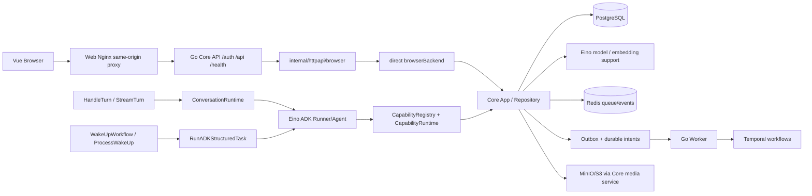

# 摇光项目第五阶段联合验收与最终审查证据报告

- Run ID: 20260919T200912+0800
- Source commit: ba6457aa5a256adbde245d6df1d062131aad4d8b
- Branch: codex/yaoguang-adk-phase2
- Repository-relative evidence root: docs/verification/phase-5/20260919T200912+0800/
- 工作区冻结时：clean；本次验收只新增第五阶段任务与证据文件，没有修改前四阶段源码。
- 工具：Go go1.26.3 darwin/arm64、Node v24.12.0、pnpm 11.0.7。

## 1. 结论摘要

本次审查没有发现需要在第五阶段临时修复的确定性源码 FAIL；但整体不能写成“前四阶段全部通过”，因为 L2/L3/L4 证据仍有明确缺口。

| 范围 | 当前结论 | 证据强度 |
|---|---|---|
| 第一阶段 Eino/Prompt/Task/旧路径 | 确定性实现和 Fake 测试通过；真实 Provider/Embedding 未验证 | PASS（L0/L1）+ BLOCKED（L4） |
| 第二阶段 ADK/工具回填/失败边界 | ADK Runner、ToolCall、结果回填、失败/取消/上限测试通过；数据库 settlement、人格接管持久副作用未运行 | PASS（L1）+ BLOCKED（L2） |
| 第三阶段 WakeUp/后台分类/权限 | WakeUp 共享 ADK、后台 surface 分类和自治边界的确定性测试通过；真实 DB/Worker/Temporal/Redis 未运行 | PASS（L1）+ BLOCKED（L2/L3） |
| 第四阶段无独立 BFF API | API browser boundary、无 HTTP forwarding、Session/CSRF/NDJSON、路由矩阵、Web/Compose 静态接线通过；真实浏览器和 disposable Compose 未运行 | PASS（L0/L1）+ BLOCKED（L3） |
| 跨阶段事务/幂等/Outbox/Temporal | 关键集成测试在缺少 GO_CORE_TEST_DATABASE_URL 时 Skip；全量 Go 测试退出 0 但有 194 个 individual test skip actions | BLOCKED |
| 外部模型/媒体兼容 | 未提供受控真实 Provider、Embedding、Temporal、MinIO/ComfyUI 配置 | BLOCKED |
| 第五阶段交付 | 报告、CSV、manifest、代码/测试证据和脱敏 bundle 已生成 | PASS |

因此，本报告的总体结论是：代码/L0-L1 确定性回归达到收口要求；外部依赖与真实浏览器验收尚未达到最终发布授权级别。

## 2. 审查对象与冻结证据

最终源码快照是 ba6457aa5a256adbde245d6df1d062131aad4d8b。前四阶段源码提交和任务归档仍可从其父提交链追溯：

- Phase 3 work：32d6b10
- Phase 4 work：2758bb0
- Phase 4 archive：5a84b6e
- Phase 4 journal：ba6457a

冻结命令和环境快照：

- commands/001-freeze.txt
- commands/002-environment.txt
- commands/003-locked-versions.txt
- commands/004-current-tasks.txt

工作区在第五阶段开始时 clean；当前报告目录和第五阶段任务规划文件属于验收产物，不属于源码修复。

本机环境：

- macOS Darwin arm64
- Go 1.26.3
- Node 24.12.0
- pnpm 11.0.7
- GO_CORE_TEST_DATABASE_URL：absent
- Redis/Temporal/S3/Provider 测试运行变量：absent

## 3. 验收依据与范围

验收依据按优先级：

1. 第五阶段用户最终要求。
2. 第一至第四阶段用户确认的 PRD/design/implement/migration 和当前项目 specs。
3. 最终源码、实际调用路径、测试执行结果。
4. 旧阶段报告仅作为待核实声明，不作为通过证明。

本阶段没有恢复任何已删除 BFF、旧 Provider、手写对话循环或第二套 Agent 引擎；Temporal、Worker、Outbox、领域事务和独立 Task 保持在验收范围内。

完整要求矩阵见 acceptance-matrix.csv。矩阵中的状态严格使用 PASS、FAIL、BLOCKED、NOT_RUN、NOT_APPLICABLE；没有因为测试 Skip 而标记 PASS。

## 4. 当前真实架构

关键实际入口：

- 对话应用入口：apps/core-go/internal/core/mutations.go:486 附近的 HandleTurn / StreamTurn。
- ADK runtime：apps/core-go/internal/core/adk_conversation_runtime.go:241-339。
- WakeUp：apps/core-go/internal/core/wakeup.go:370-512。
- API public mount：apps/core-go/internal/httpapi/server.go:129-149。
- Browser direct backend：apps/core-go/internal/httpapi/browser_backend.go:22-115 及后续 operation dispatch。
- Web same-origin proxy：apps/web/nginx.conf:18-32。
- Compose 移除 standalone BFF：infra/compose/fluctlight.compose.yml:208-242。

## 5. 分阶段核验

### 5.1 第一阶段：Eino、Prompt、Task

已确认：

- Eino ChatModel/Embedder factory 和 provider call support 位于 eino_model_runtime.go，每次 Generate/Stream 进入现有 queue/correlation/diagnostic boundary。
- Prompt Composer、WorkingMemory、required budget overflow、whole-turn preservation、current-input dedup 和 slot cancellation 具备确定性测试。
- ModelTask、Embedding、Stream 等独立任务仍保留独立边界；ADK 只用于需要模型—工具循环的 surface。
- 当前生产源码静态扫描没有发现 apps/gateway-go、旧 BFF、旧 generic conversation facade 或旧模型 HTTP 路径。
- S1 确定性专项：14 个测试通过。

限制：

- 没有受控真实 Provider/Embedding endpoint；L4 compatibility 为 BLOCKED。
- 没有单独覆盖每一个 ModelTask wrapper 的 request/response contract test；该项在矩阵中为 NOT_RUN，而不是假设通过。

证据：

- evidence/code/S1-model-runtime.txt
- evidence/tests/S1-eino-prompt-queue.txt
- commands/015-static-scan.txt

### 5.2 第二阶段：ADK 对话与人格能力

已确认：

- NewADKCapabilityTools 从正式 CapabilityDefinition 构建工具，缺少 formal tool-call identity 时 fail closed。
- RunADKLoop 负责模型—工具—结果回填—继续生成，iteration limit 上限为 2；模型失败、工具失败、取消不会制造 final success。
- Main 和 takeover B 使用 ADK；Judge、query continuation 和持久切换评估仍是明确的专用边界。
- deterministic policy source 与 native model tool source 分开。
- S2 Fake/运行时专项中 2 个 ADK/trace 测试通过；9 个依赖 PostgreSQL settlement/人格副作用的测试 Skip。

限制：

- HandleTurn 生产 settlement、A/B winner、persistent switch、recovery 和 rejected-candidate no-fact-trail 的数据库证据未执行。
- 不能用 L1 Fake ADK 结果替代 L2 PostgreSQL transaction/CAS/idempotency 证明。

证据：

- evidence/code/S2-adk-runtime.txt
- evidence/tests/S2-adk-persona.txt
- evidence/tests/CROSS-db-integration.txt

### 5.3 第三阶段：WakeUp 与后台主动行为

已确认：

- ProcessWakeUp 使用共享 RunADKStructuredTask/ADK surface，并保留 cancellation marker、cycle、intent、自治策略、freeze 和 settlement 接线。
- WakeUp、Daily Review、Native Cognition 的 surface 分类测试通过；不需要循环的后台任务没有被强行套成通用 Agent。
- S3 确定性专项中 26 个测试通过。

限制：

- PostgreSQL WakeUp persistence、intent/outbox/replay、Native Cognition cycle guard 和自治副作用集成测试因为缺少数据库而 Skip。
- Worker restart、Temporal Activity retry/cancel、Redis event delivery、MinIO/ComfyUI 等 L2/L3/L4 证据未运行。

证据：

- evidence/code/S3-wakeup.txt
- evidence/tests/S3-wakeup-background.txt
- evidence/tests/CROSS-db-integration.txt

### 5.4 第四阶段：无独立 BFF 的浏览器 API

已确认：

- Server.Handler 将 /auth、/api、/health 交给 browser boundary；/internal 仍走 service-key protected handler。
- browserBackend 直接调用 App/Repository；architecture test 明确拒绝 http.Client、http.NewRequest、Core URL forwarding。
- Session invalidation、non-empty login/setup token、CSRF、Trusted Origin、same-origin Nginx、NDJSON translation、media URL and Range path 有 L1/static evidence。
- OpenAPI route inventory 包含当前 77 个 method/path operations；route matrix 和 unknown-route/invalid-origin tests 通过。
- apps/gateway-go、BFF image/service/env/CI references 已删除；静态 deletion scan 通过。
- Web 46 个测试通过，browser-client 11 个测试通过，typecheck/lint/build/generate/Compose config 通过。

限制：

- 没有 disposable Compose 中启动 Core + Worker + Nginx 的 L3 browser run。
- 没有真实浏览器 login → read → conversation → output → logout；本报告不把 curl 或 Handler httptest 作为替代。

证据：

- evidence/tests/S4-browser-api.txt
- evidence/code/S4-deployment.txt
- commands/014-generation-and-config.txt
- commands/015-static-scan.txt

## 6. 跨阶段业务回归

### A. 对话：Browser/HandleTurn → Composer → ADK → Capability → settlement → output

L0/L1 已证明：

1. HandleTurn/ConversationRuntime 进入 ADK。
2. Fake model 产生 formal ToolCall。
3. Capability adapter 保留 call ID/source 并执行。
4. Tool result 进入下一轮输入。
5. ADK 在 iteration/failure/cancel 边界终止。
6. API NDJSON translator 不会把内部事件直接发布。

L2 未证明：

- 真实数据库中的 assistant/user/frozen action/inbox/outbox side effects。
- retry/cancel/commit-after-disconnect 的最终数据库和消息结果。

### B. 人格接管：Judge → B scope rebuild → permissions → winner settlement

L0/L1 已证明：

- takeover schema、B prompt scope、persistent-switch grant restrictions、policy/native source 区分和 capability validation 接线存在。
- takeover runtime trace 测试通过。

L2 未证明：

- rejected A 不落库、不发布、无 fact trail。
- B 的持久切换提案在数据库提交边界被拒绝。
- recovery/winner replay 不重复副作用。

### C. WakeUp：Workflow → ProcessWakeUp → shared ADK → autonomy/freeze/intent/outbox

L0/L1 已证明：

- WakeUp 入口调用共享 ADK structured-task。
- WakeUp surface 和 capability catalog 约束存在。
- 取消、工具反馈、无动作/输出策略的确定性测试通过。

L2/L3 未证明：

- WakeUp persistence transaction、next due、reflection/action intent/outbox、replay/idempotency。
- Worker/Temporal/Redis 真实运行与重启恢复。

### D. 浏览器：Browser → Nginx → API boundary → Session/DTO → Core App → output

L0/L1 已证明：

- API public mount、Session/CSRF/Origin/DTO/NDJSON/media boundary。
- route matrix/OpenAPI inventory。
- no standalone gateway and no HTTP forwarding.
- same-origin Nginx and Compose/CI configuration are structurally valid.

L3 未证明：

- 可运行 Web Nginx/Core/Worker 部署上的真实浏览器链路。
- 浏览器 Cookie、CSRF、NDJSON rendering 和 console error 的实际观察。

## 7. 测试执行记录

关键正式命令及结果：

| 命令证据 | 结果 |
|---|---|
| commands/010-core-full-test.txt | exit 0 |
| commands/011-core-race.txt | exit 0 |
| commands/012-core-vet-tidy-format.txt | exit 0 |
| commands/013-web-and-client.txt | exit 0；Web 46 tests、Browser Client 11 tests |
| commands/014-generation-and-config.txt | exit 0 |
| commands/015-static-scan.txt | exit 0；standalone gateway absent |
| commands/016-core-json-summary.txt | exit 0；full Go JSON run recorded 194 individual test skip actions |
| evidence/tests/S1-eino-prompt-queue.txt | 14 PASS |
| evidence/tests/S2-adk-persona.txt | 2 PASS、9 SKIP |
| evidence/tests/S3-wakeup-background.txt | 26 PASS、5 SKIP |
| evidence/tests/S4-browser-api.txt | 16 PASS |
| evidence/tests/CROSS-db-integration.txt | 5 SKIP，exit 0，不计为通过 |

Skip 的具体原因是测试基座要求 GO_CORE_TEST_DATABASE_URL 或相应外部服务，而当前环境未提供；它们在矩阵中保持 BLOCKED/NOT_RUN。

## 8. 缺陷与修复

本第五阶段没有确认需要修改前四阶段源码的 FAIL，因此没有“先失败后修复”的源码补丁。已有代码静态和 L1 结果未被改写或删除；旧阶段总结中的真实 DB/浏览器/Provider 声明按本报告重新降级为对应 BLOCKED，而不是沿用“全量通过”表述。

子代理审计在本次运行中因平台 usage limit 未产生结果，因此没有把子代理输出作为验收证据；主线程使用相同源码、测试和命令重新核查。

证据脱敏扫描第一次匹配到了扫描命令自身包含的正则字面量；未把该自匹配当作源码/证据泄露，随后用排除扫描器命令文本的最终规则重跑并通过，详见 commands/017-evidence-secret-scan.txt、commands/018-evidence-secret-scan-final.txt 和 commands/019-evidence-secret-scan-final.txt。

## 9. 可扩展性与调用开销观察

确定性扩展证据：

- 新增/验证普通 ADK 工具通过 CapabilityDefinition → NewADKCapabilityTools → RunADKLoop，无需改变通用循环。
- Prompt Slot 只在显式 Composer input 中被选用；未选 surface 不会接收。
- API browser route 新增职责通过 browser.Backend 和 route inventory 接入，不建立第二个网关。

调用开销：

- Provider queue/ADK iteration cap 有确定性上限测试。
- 本次没有真实模型 latency、usage 或 P99 baseline；不能宣称性能提升或无回退。
- Fake 模型耗时不代表真实 Provider 延迟。

## 10. 验证局限与复核建议

未运行条件：

- GO_CORE_TEST_DATABASE_URL / 隔离 PostgreSQL。
- Redis integration、Temporal server/namespace、Worker restart/recovery。
- MinIO/ComfyUI、真实 Provider/Embedding/vision endpoint。
- 可用浏览器和完整 Docker Compose smoke。

外部复核建议：

1. 复制私有 Compose env 到隔离环境，设置测试专用 FLUCTLIGHT_TRUSTED_ORIGIN 和 Secure cookie 配置。
2. 启动 disposable PostgreSQL/Redis/Temporal/MinIO/Core/Worker/Web，不启动任何独立 BFF。
3. 运行已有浏览器链路并保存脱敏网络/console/截图。
4. 用 GO_CORE_TEST_DATABASE_URL 重跑 evidence/tests/CROSS-db-integration.txt 中的事务、幂等、WakeUp、Native Cognition、takeover 集成测试。
5. 如需 L4，再显式配置测试 Provider/Embedding/视觉服务并限制预算。
6. 以同一 source commit ba6457aa5a256adbde245d6df1d062131aad4d8b 复核；不要把本地报告直接当作生产发布授权。

## 11. Evidence manifest

- acceptance-matrix.csv
- manifest.json
- evidence/code/
- evidence/tests/
- evidence/commands/

本报告的完整证据文件均为相对路径，日志不包含 secret/cookie/token；bundle 生成后由 manifest 和 SHA-256 关联.

